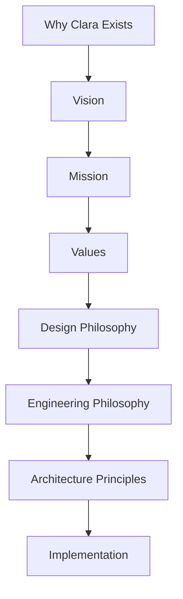

---

book: "Book I — The Foundation"
chapter: "01"
title: "Preface"
version: "1.0.0"
status: "official"
owner: "Clara Core Team"
last_updated: "2026-07-06"
classification: "constitutional-documentation"
previous: "../README.md"
next: "./02-Why-Clara-Exists.md"
---------------------------------

# Preface

> *"Every great system begins with a simple question: Why does it need to exist?"*

---

## Table of Contents

* [Purpose](#purpose)
* [What is Clara?](#what-is-Clara)
* [Why This Project Exists](#why-this-project-exists)
* [A Long-Term Vision](#a-long-term-vision)
* [AI as Infrastructure](#ai-as-infrastructure)
* [Engineering Philosophy](#engineering-philosophy)
* [Documentation as Architecture](#documentation-as-architecture)
* [The Role of Book I](#the-role-of-book-i)
* [Guiding Beliefs](#guiding-beliefs)
* [Reading This Library](#reading-this-library)
* [Key Takeaways](#key-takeaways)
* [Navigation](#navigation)

---

## Purpose

This document introduces the Clara Project and establishes the mindset required to understand the philosophy behind every decision documented throughout the Clara Engineering Library.

Clara is not simply a software application, nor is it a collection of independent products. It is an engineering initiative to build an intelligent business operating system capable of supporting organizations as they grow in size, complexity, and technological maturity.

Before discussing architecture, code, infrastructure, or artificial intelligence, it is essential to understand why Clara exists.

---

## What is Clara?

Clara is an AI-native Business Operating System designed to unify business operations, organizational knowledge, customer interactions, automation, and decision-making into a single cohesive platform.

Rather than replacing existing business processes, Clara provides a common foundation where information, services, and intelligence can work together.

The long-term objective is not to build another application.

The objective is to build the digital operating system that powers modern organizations.

---

## Why This Project Exists

Modern organizations rely on dozens of disconnected systems.

A customer relationship may begin in a messaging platform, continue through a CRM, generate invoices in an accounting system, trigger workflows in an automation platform, and produce reports in a separate analytics solution.

Although each application performs its intended function, the organization itself becomes fragmented.

Information is duplicated.

Processes become inconsistent.

Knowledge is lost.

Employees spend significant time navigating software instead of solving business problems.

Clara exists to reduce this fragmentation.

Its purpose is to create a unified platform where applications, data, artificial intelligence, and workflows operate as parts of a single ecosystem.

---

## A Long-Term Vision

Clara is designed with a long-term perspective.

Technologies, programming languages, frameworks, cloud providers, and AI models will continue to evolve.

The principles documented in this library should remain stable despite those technological changes.

Every engineering decision should prioritize long-term maintainability over short-term convenience.

Clara is intended to be a platform that evolves over decades rather than a product optimized for rapid but unsustainable growth.

---

## AI as Infrastructure

Artificial Intelligence is one of Clara's core capabilities.

However, Clara does not consider AI to be the product itself.

AI should function as infrastructure that enhances user productivity, improves automation, assists decision-making, and increases organizational efficiency.

Human judgment remains the final authority whenever business-critical decisions are made.

The goal is not autonomous organizations.

The goal is augmented organizations.

---

## Engineering Philosophy

Clara is built on the belief that software engineering is fundamentally an exercise in managing complexity.

Complexity cannot be eliminated entirely.

It can only be organized.

Therefore, every architectural decision should contribute to one or more of the following objectives:

* Reduce cognitive load.
* Improve maintainability.
* Increase reliability.
* Strengthen security.
* Preserve flexibility.
* Enable future evolution.

Engineering excellence is measured not by the number of technologies adopted but by the clarity, simplicity, and sustainability of the resulting system.

---

## Documentation as Architecture

Documentation is considered a first-class engineering artifact.

Every architectural decision should be documented before implementation.

Every major feature should have a clearly defined purpose, technical design, and operational considerations.

Code explains how a system works.

Documentation explains why it exists.

Both are equally important.

---

## The Role of Book I

Book I establishes the constitutional principles of Clara.

It does not describe implementation details.

Instead, it defines the values, philosophy, engineering mindset, and decision-making framework that every subsequent document must follow.

The remaining books within the Clara Engineering Library expand upon these principles by describing architecture, implementation, operations, artificial intelligence, governance, and product evolution.

Whenever uncertainty arises during development, this book should serve as the primary reference.

---

## Guiding Beliefs

The Clara Project is founded upon several fundamental beliefs.

We believe complexity should be hidden from users, not embraced.

We believe software should adapt to businesses rather than forcing businesses to adapt to software.

We believe organizational knowledge is one of the most valuable assets a company possesses.

We believe security should be designed into every component instead of added as an afterthought.

We believe artificial intelligence should amplify human capability rather than replace human responsibility.

We believe technology should become simpler as it becomes more powerful.

These beliefs guide every architectural, engineering, and product decision made within the Clara Project.

---

## Reading This Library

Readers are encouraged to progress through the books in the documented order.

Each subsequent volume assumes an understanding of the principles established in Book I.

Skipping foundational concepts may lead to misunderstanding architectural decisions presented later in the library.

Book I explains **why** Clara exists.

The following books explain **how** Clara is designed and **how** it should be built.

---

## Foundation Flow

---

## Key Takeaways

* Clara is an AI-native Business Operating System, not a single application.
* Clara exists to reduce fragmentation, preserve knowledge, and unify business operations.
* AI is treated as infrastructure, not as the product itself.
* Documentation is part of architecture.
* Book I is the constitutional foundation for all future Clara documentation and implementation.

---

## Related Documents

* `README.md`
* `02-Why-Clara-Exists.md`
* `08-Engineering-Philosophy.md`
* `12-Architecture-Principles.md`
* `18-Declaration.md`

---

## Navigation

**Previous:** [README.md](../README.md)

**Next:** [02-Why-Clara-Exists.md](./02-Why-Clara-Exists.md)
