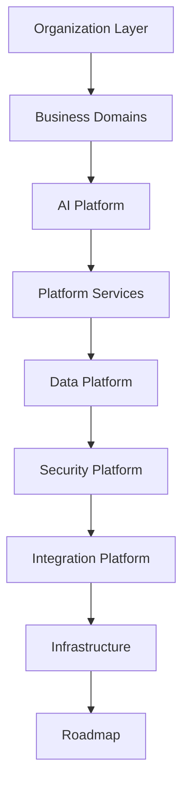

# Executive Overview

> *"Book II transforms Athena's principles into a buildable platform blueprint."*

---

# Purpose

This chapter introduces Book II — Master Blueprint.

If Book I explains why Athena exists, Book II explains what Athena will build.

Book II is the master planning document for Athena's platform, domains, services, AI capabilities, data platform, security model, integrations, infrastructure, and roadmap.

It does not define final implementation details. Instead, it establishes the blueprint that later architecture, engineering, product, AI, and operations documents must follow.

---

# What Athena Is

Athena is an AI-native Business Operating System.

It is designed to unify business operations, customer relationships, communication, knowledge, workflows, automation, artificial intelligence, integrations, analytics, and governance into one coherent platform.

Athena is not a CRM only.

Athena is not a helpdesk only.

Athena is not an AI chatbot only.

Athena is a platform for operating and improving an organization.

---

# Why Book II Exists

Modern business software often grows as a collection of disconnected applications.

Each tool solves a local problem, but the organization becomes fragmented.

Book II exists to prevent Athena from becoming fragmented.

It defines the complete platform blueprint before implementation details dominate decision-making.

---

# Blueprint Layers

Athena is organized into major layers:

Each layer has a clear responsibility and relationship to the rest of the platform.

---

# What Book II Produces

Book II becomes the source for:

- Product Requirements Documents.
- Technical Design Documents.
- Architecture specifications.
- API specifications.
- Security specifications.
- AI specifications.
- Database specifications.
- Integration specifications.
- Test plans.
- Runbooks.
- Architecture Decision Records.

---

# Key Takeaways

- Book II defines what Athena will build.
- Athena is designed as one platform, not disconnected apps.
- The blueprint is organized by layers, domains, and reusable capabilities.
- Later books and technical documents should trace back to Book II.

---

# Related Documents

- ../../BOOK-01-The-Foundation/18-Declaration.md
- ../../standards/ADS.md
- ../../templates/book-template.md
- ../../glossary/Organization.md

---

# Navigation

**Previous:** README.md

**Next:** 02-Athena-Big-Picture.md
