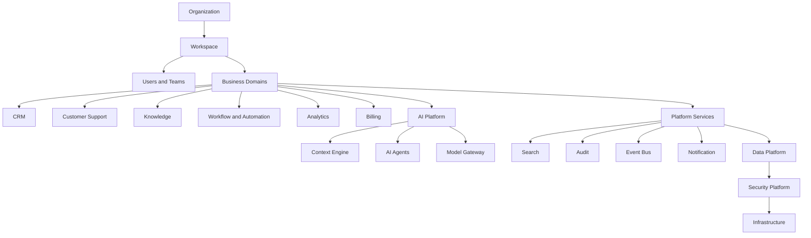

# Clara Big Picture

> *"Clara connects the work, knowledge, people, and intelligence of an organization."*

---

# Purpose

This chapter explains Clara from the highest possible perspective.

It provides a shared mental model for understanding how Clara's major areas fit together as one platform.

---

# The Big Picture

Clara begins with an Organization.

Inside an Organization, people work inside Workspaces.

Inside Workspaces, business Domains coordinate customers, conversations, workflows, tasks, knowledge, analytics, and operations.

AI capabilities assist these activities through context-aware intelligence.

Platform Services provide reusable capabilities such as search, audit, notifications, storage, event processing, scheduling, and reporting.

Security and governance protect every layer.

---

# Big Picture Map

---

# One Platform, Many Capabilities

Clara should feel like one system even though it contains many capabilities.

Users should not experience disconnected modules.

Data should remain connected.

Workflows should move across domains.

AI should understand organizational context.

Security should apply consistently across the platform.

---

# Platform Mental Model

Clara can be understood through five questions:

1. Who owns the work?
2. Where does the work happen?
3. What business capability is involved?
4. What data and knowledge are needed?
5. How can AI and automation improve the outcome?

---

# Key Takeaways

- Clara is organized around Organization and Workspace.
- Business Domains represent core operational capabilities.
- Platform Services provide reusable foundations.
- AI works across the platform through context, knowledge, memory, agents, and models.
- Security and governance apply everywhere.

---

# Related Documents

- ../../glossary/Organization.md
- ../../glossary/Workspace.md
- ../../glossary/Domain.md
- ../../glossary/Service.md
- ../../glossary/Agent.md

---

# Navigation

**Previous:** 01-Executive-Overview.md

**Next:** 03-Platform-Philosophy.md
