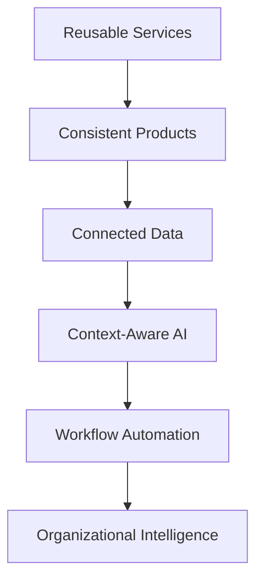

# Platform Philosophy

> *"A platform becomes powerful when every new capability strengthens the whole."*

---

# Purpose

This chapter defines the philosophy behind Athena as a platform.

It explains how Athena should grow without becoming fragmented.

---

# Platform Before Features

Athena should not be built as a pile of isolated features.

Every new capability should strengthen the shared platform.

A feature that solves one problem but weakens platform consistency creates long-term cost.

---

# Reusable Capabilities

Athena should prefer reusable platform capabilities over repeated local implementations.

Examples:

- Identity.
- Authorization.
- Audit.
- Notification.
- Search.
- Storage.
- Event Bus.
- Workflow.
- AI Context.
- Reporting.
- Import and Export.

When a capability is useful across domains, it should become part of the platform.

---

# Context Continuity

Athena should preserve context across modules.

A Customer should remain understandable across CRM, Support, Conversation, Ticket, Billing, and Analytics.

AI should not need to rediscover context every time a user changes screen.

---

# Secure by Default

Platform capabilities should be secure by default.

Security should not depend on every feature team manually remembering all controls.

The platform should provide secure primitives for authentication, authorization, auditability, tenant isolation, and data protection.

---

# Composable Architecture

Athena should support composition.

Domains, services, workflows, AI agents, plugins, and integrations should work together through defined contracts.

Composable systems evolve faster because new capabilities can reuse existing foundations.

---

# Platform Philosophy Map

---

# Key Takeaways

- Athena prioritizes platform strength over isolated features.
- Shared services reduce duplication.
- Context continuity is essential.
- Secure defaults belong in the platform foundation.
- Composability enables long-term growth.

---

# Related Documents

- ../../BOOK-01-The-Foundation/13-Product-Principles.md
- ../../BOOK-01-The-Foundation/12-Architecture-Principles.md
- ../../glossary/Service.md
- ../../glossary/Workflow.md

---

# Navigation

**Previous:** 02-Athena-Big-Picture.md

**Next:** 04-Platform-Vision.md
