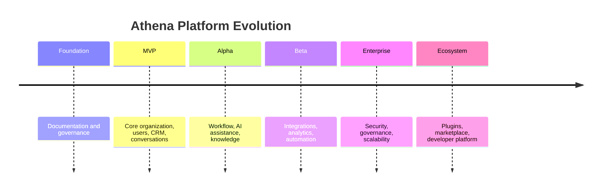

# Platform Vision

> *"Athena should become the operating environment through which organizations understand and improve their work."*

---

# Purpose

This chapter defines Athena's platform vision.

It describes the long-term direction that should guide product, architecture, engineering, AI, and ecosystem decisions.

---

# Vision Statement

Athena aims to become the trusted AI-native Business Operating System for modern organizations.

It should help organizations manage customers, conversations, workflows, knowledge, automation, and decision-making through one secure and intelligent platform.

---

# The Future Athena Enables

Athena should enable organizations where:

- Knowledge does not disappear.
- AI understands business context.
- Customer history is connected.
- Workflows cross systems naturally.
- Automation remains accountable.
- Security is built in.
- Teams collaborate with less friction.
- Decisions improve over time.

---

# Platform Evolution

Athena should evolve in stages.

---

# Long-Term Destination

Athena should become:

- A system of record for business relationships.
- A system of engagement for communication.
- A system of automation for workflows.
- A system of intelligence for AI-assisted decisions.
- A system of governance for security and auditability.
- A platform ecosystem for extensions and integrations.

---

# Key Takeaways

- Athena's vision is platform-level, not feature-level.
- The goal is organizational intelligence.
- AI, data, workflow, and security must evolve together.
- The platform should support long-term ecosystem growth.

---

# Related Documents

- ../../BOOK-01-The-Foundation/04-The-Athena-Vision.md
- ../../BOOK-01-The-Foundation/09-AI-Philosophy.md
- ../../glossary/Knowledge.md
- ../../glossary/Plugin.md

---

# Navigation

**Previous:** 03-Platform-Philosophy.md

**Next:** 05-Core-Principles.md
