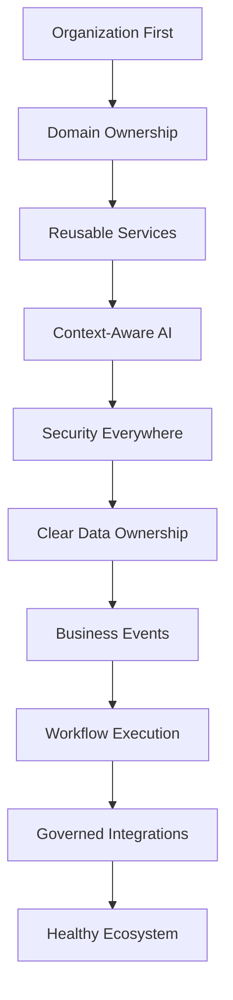

# Core Principles

> *"Blueprint principles turn vision into consistent design."*

---

# Purpose

This chapter defines the core principles that guide Book II.

These principles translate Book I's foundation into practical blueprint-level guidance.

---

# Principle 1 — Organization First

Every Athena capability should be traceable to an Organization and Workspace.

This ensures ownership, governance, data isolation, and accountability remain clear.

---

# Principle 2 — Domains Own Business Meaning

Business Domains define boundaries.

Technical components should support Domain ownership rather than blur it.

---

# Principle 3 — Platform Services Are Reusable

Reusable services should be designed once and used across many domains.

This reduces duplication and increases consistency.

---

# Principle 4 — AI Must Be Context-Aware

AI capabilities must operate with authorized, relevant, and traceable context.

AI without context is generic.

Athena AI should be organization-aware.

---

# Principle 5 — Security Is Everywhere

Security applies across all layers.

No domain, service, plugin, AI agent, or integration should bypass authentication, authorization, auditability, and data protection.

---

# Principle 6 — Data Ownership Must Be Clear

Every important entity should have one source of truth.

Derived data, indexes, projections, and caches must not become competing authorities.

---

# Principle 7 — Events Represent Business Facts

Events should describe meaningful business changes.

They should not be treated as technical noise.

---

# Principle 8 — Workflows Coordinate Business Execution

Workflows turn business intent into repeatable action.

They should remain observable, auditable, and recoverable.

---

# Principle 9 — Integrations Must Be Governed

Athena should integrate with external systems through secure, observable, and versioned contracts.

---

# Principle 10 — The Ecosystem Should Extend, Not Corrupt

Plugins and external extensions should use approved APIs, permissions, and extension points.

They must not depend on undocumented internals.

---

# Principles Map

---

# Key Takeaways

- Book II turns philosophy into blueprint.
- Organization, Domain, Service, Event, Workflow, AI, Data, Security, and Plugin concepts must remain consistent.
- These principles guide every later Part in Book II.

---

# Related Documents

- ../../BOOK-01-The-Foundation/12-Architecture-Principles.md
- ../../BOOK-01-The-Foundation/15-Decision-Principles.md
- ../../standards/QUALITY-STANDARD.md

---

# Navigation

**Previous:** 04-Platform-Vision.md

**Next:** 06-Business-Capability-Map.md
