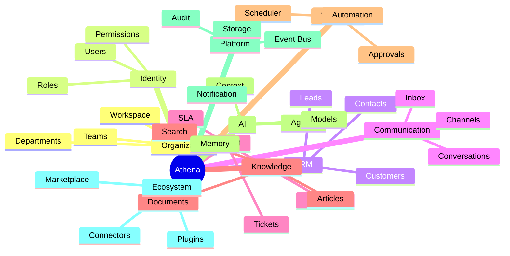

# Business Capability Map

> *"Capabilities describe what the organization needs to do, before deciding how software should implement it."*

---

# Purpose

This chapter maps the major business capabilities Athena should support.

A capability map helps Athena avoid designing around screens or technologies too early.

---

# Capability Groups

Athena's business capabilities can be grouped into:

- Organization Management.
- Identity and Access.
- Customer Relationship Management.
- Communication.
- Customer Support.
- Sales.
- Marketing.
- Knowledge.
- Workflow and Automation.
- Tasks and Projects.
- Analytics.
- Finance and Billing.
- Integrations.
- AI Assistance.
- Governance and Security.

---

# Capability Map



---

# Why Capability Mapping Matters

Capability mapping helps Athena answer:

- What does the platform need to support?
- Which business areas are core?
- Which capabilities should be reusable?
- Which areas require dedicated domains?
- Which services should be shared?

---

# Capability vs Feature

A capability is stable.

A feature is one way of delivering a capability.

Example:

```text
Capability: Customer Communication
Feature: Omnichannel Inbox
Feature: AI Reply Suggestion
Feature: Conversation Assignment
```

Athena should design capabilities before features.

---

# Key Takeaways

- Capability maps help prevent fragmented product design.
- Athena should be organized around stable business capabilities.
- Features should be traced back to capabilities.
- Domains and services should emerge from capability ownership.

---

# Related Documents

- ../../glossary/Domain.md
- ../../glossary/Service.md
- ../../glossary/Customer.md
- ../../glossary/Workflow.md

---

# Navigation

**Previous:** 05-Core-Principles.md

**Next:** 07-Domain-Map.md
