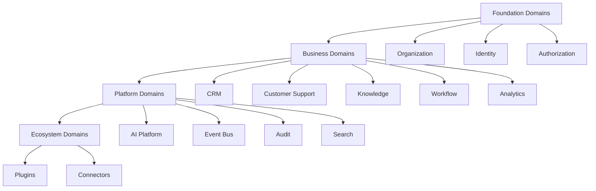

# Domain Map

> *"Domains give ownership to business meaning."*

---

# Purpose

This chapter maps Clara's major business and platform domains.

Domains organize business responsibilities and provide boundaries for future architecture.

---

# Domain Categories

Clara domains may be grouped into:

## Foundation Domains

- Organization.
- Workspace.
- Identity.
- Authorization.

## Business Domains

- CRM.
- Customer.
- Lead.
- Communication.
- Inbox.
- Customer Support.
- Sales.
- Marketing.
- Knowledge.
- Workflow.
- Automation.
- Tasks.
- Projects.
- Calendar.
- Analytics.
- Finance.
- Billing.
- Inventory.
- HR.
- Custom Objects.

## Platform Domains

- AI.
- Notification.
- Search.
- Audit.
- Event Bus.
- Storage.
- Scheduler.
- Config.
- Feature Flags.
- Secrets.
- Reporting.
- Import and Export.

## Ecosystem Domains

- Integration.
- Plugin.
- Marketplace.
- Developer Platform.
- Extension SDK.

---

# Domain Map

---

# Domain Ownership Rule

Each domain should define:

- What it owns.
- What it does not own.
- Which data belongs to it.
- Which events it publishes.
- Which services support it.
- Which permissions protect it.

---

# Key Takeaways

- Domains are business ownership boundaries.
- Clara should not organize around technical layers only.
- Every major capability should eventually map to a domain.
- Domain ownership prevents duplicated authority.

---

# Related Documents

- ../../glossary/Domain.md
- ../../glossary/Event.md
- ../../glossary/Service.md
- ../../templates/domain-template.md

---

# Navigation

**Previous:** 06-Business-Capability-Map.md

**Next:** 08-Product-Map.md
