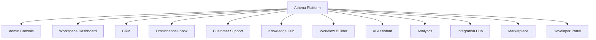

# Product Map

> *"Products are the visible surfaces of deeper platform capabilities."*

---

# Purpose

This chapter explains the major user-facing product surfaces Athena may provide.

A Product Map helps distinguish product experience from underlying domains and services.

---

# Product Surfaces

Athena may include these major product surfaces:

- Admin Console.
- Workspace Dashboard.
- CRM.
- Omnichannel Inbox.
- Customer Support.
- Knowledge Hub.
- Workflow Builder.
- Automation Center.
- AI Assistant.
- Analytics.
- Billing.
- Integration Hub.
- Marketplace.
- Developer Portal.

---

# Product Map



---

# Product vs Domain

A product surface may use multiple domains.

Example:

```text
Omnichannel Inbox
├── Communication Domain
├── Customer Domain
├── AI Domain
├── Workflow Domain
├── Notification Service
└── Audit Service
```

This distinction prevents UI design from incorrectly defining domain ownership.

---

# Product Experience Principles

Products should be:

- Simple.
- Consistent.
- Secure.
- Context-aware.
- Accessible.
- Observable.
- AI-assisted where useful.
- Integrated with platform services.

---

# Key Takeaways

- Product surfaces are not the same as domains.
- A product may compose multiple domains and services.
- Athena should feel like one platform even with many product surfaces.
- Product design should preserve shared context.

---

# Related Documents

- ../../BOOK-01-The-Foundation/13-Product-Principles.md
- ../../glossary/Domain.md
- ../../glossary/Service.md
- ../../templates/prd-template.md
- ../../templates/ux-spec-template.md

---

# Navigation

**Previous:** 07-Domain-Map.md

**Next:** 09-System-Landscape.md
