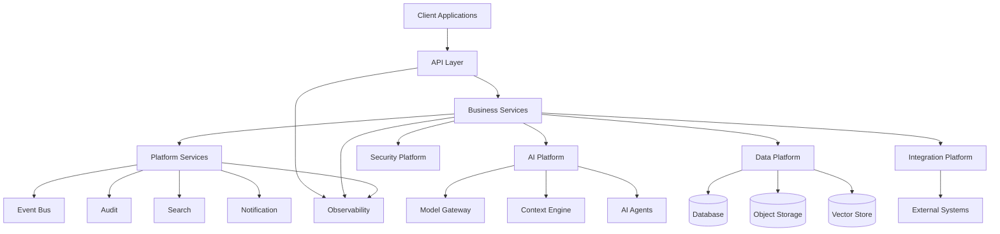

# System Landscape

> *"A system landscape shows the major territories of the platform before drawing detailed architecture."*

---

# Purpose

This chapter describes Athena's high-level system landscape.

It is not a final architecture diagram. It identifies the major platform areas that later architecture documents will expand.

---

# System Areas

Athena's system landscape includes:

- Client Applications.
- API Layer.
- Business Services.
- Platform Services.
- AI Platform.
- Data Platform.
- Security Platform.
- Integration Platform.
- Infrastructure.
- Observability.

---

# Landscape Map

---

# Client Applications

Athena may support:

- Web application.
- Mobile application.
- Browser extension.
- Desktop application.
- Developer console.
- Admin console.
- External API consumers.

---

# API Layer

The API Layer exposes Athena capabilities through secure and documented interfaces.

It should enforce authentication, authorization, validation, rate limits, and observability.

---

# Business Services

Business Services implement domain capabilities such as CRM, Communication, Customer Support, Knowledge, Workflow, Billing, and Analytics.

---

# Platform Services

Platform Services provide reusable capabilities shared across domains.

Examples include Audit, Notification, Search, Event Bus, Storage, Scheduler, Config, Secrets, Reporting, Import, and Export.

---

# AI Platform

The AI Platform provides Model Gateway, Context Engine, Memory, Knowledge retrieval, AI Agents, Tool Calling, Evaluation, and Governance.

---

# Data Platform

The Data Platform manages persistence, ownership, lifecycle, indexing, caching, backup, archiving, and analytics.

---

# Security Platform

The Security Platform provides identity, authentication, authorization, secrets, encryption, audit strategy, compliance, and zero trust foundations.

---

# Integration Platform

The Integration Platform connects Athena to external systems through REST APIs, webhooks, OAuth, plugins, connectors, SDKs, and marketplace capabilities.

---

# Key Takeaways

- Athena's system landscape is layered.
- Business Services depend on reusable Platform Services.
- AI, Data, Security, and Integration are first-class platform areas.
- Observability should apply across all layers.

---

# Related Documents

- ../../glossary/Service.md
- ../../glossary/Agent.md
- ../../glossary/Plugin.md
- ../../templates/architecture-template.md

---

# Navigation

**Previous:** 08-Product-Map.md

**Next:** 10-Future-Vision.md
