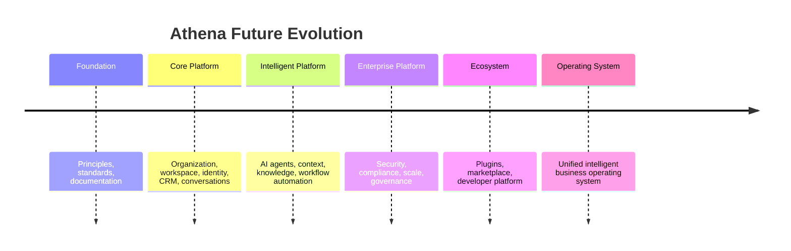

# Future Vision

> *"Athena should evolve from a platform into an ecosystem."*

---

# Purpose

This chapter defines the long-term future vision of Athena beyond the initial platform blueprint.

It explains how Athena can evolve from core platform to enterprise platform to ecosystem.

---

# Evolution Stages

---

# Stage 1 — Foundation

Athena establishes principles, standards, templates, glossary, and documentation governance.

This enables consistent long-term engineering.

---

# Stage 2 — Core Platform

Athena provides foundational capabilities:

- Organization.
- Workspace.
- User.
- Role.
- Permission.
- CRM.
- Customer.
- Conversation.
- Ticket.
- Knowledge.
- Workflow.

---

# Stage 3 — Intelligent Platform

Athena introduces AI-native capabilities:

- Context Engine.
- Knowledge Engine.
- Memory.
- AI Agents.
- Model Gateway.
- Tool Calling.
- AI Evaluation.
- Human-in-the-loop workflows.

---

# Stage 4 — Enterprise Platform

Athena becomes suitable for serious organizational deployment through:

- Strong IAM.
- Zero Trust.
- Auditability.
- Compliance.
- Multi-tenancy.
- Observability.
- Disaster recovery.
- Secure integrations.

---

# Stage 5 — Ecosystem

Athena opens controlled extension points through:

- Plugin SDK.
- Extension SDK.
- Marketplace.
- Developer Portal.
- External Connectors.
- AI Tool Marketplace.
- Integration Hub.

---

# Stage 6 — Business Operating System

Athena becomes a unified operating environment for organizations.

At this stage, Athena is not merely a tool used by teams.

It becomes the platform where organizational work, knowledge, automation, communication, and intelligence converge.

---

# Future Design Commitments

Athena should continue to protect:

- Human authority.
- Security by design.
- Data ownership.
- Platform consistency.
- AI explainability.
- Long-term maintainability.
- Ecosystem governance.
- Documentation quality.

---

# Key Takeaways

- Athena should evolve gradually, not through uncontrolled expansion.
- The platform should become more intelligent without becoming less trustworthy.
- Ecosystem growth must preserve security and governance.
- Future Athena should remain aligned with Book I principles.

---

# Related Documents

- ../../BOOK-01-The-Foundation/17-Athena-Manifesto.md
- ../../BOOK-01-The-Foundation/18-Declaration.md
- ../../glossary/Plugin.md
- ../../glossary/Agent.md
- ../../templates/roadmap-template.md

---

# Navigation

**Previous:** 09-System-Landscape.md

**Next:** ../PART-02-Organization-Layer/11-Organization.md
