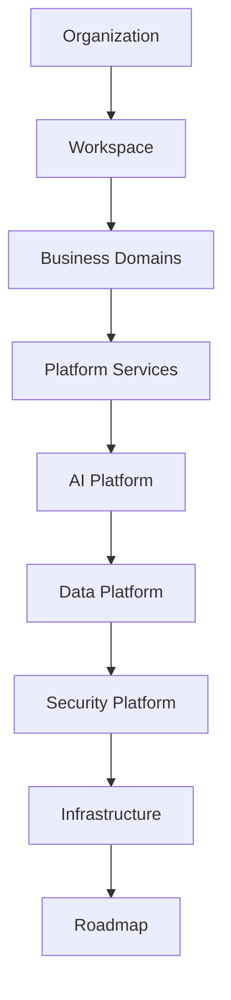

# PART-01 — Platform Vision

> *"A platform must be understood before it can be built."*

---

# Purpose

Part I defines the high-level vision of Clara as an AI-native Business Operating System.

It explains what Clara is, what the platform intends to become, how its major capabilities relate to each other, and why Clara should be designed as one coherent platform rather than a collection of disconnected applications.

---

# Goals

- Establish the strategic platform vision.
- Define Clara at the highest blueprint level.
- Explain the relationship between business capabilities, domains, products, and systems.
- Provide a shared mental model before entering deeper domain and architecture chapters.
- Prepare readers for the Organization Layer, Business Domains, AI Platform, Platform Services, and Roadmap.

---

# Scope

## In Scope

- Executive-level platform overview.
- Big picture of Clara.
- Platform philosophy.
- Capability map.
- Domain map.
- Product map.
- System landscape.
- Future vision.

## Out of Scope

- Detailed implementation.
- Database schema.
- API contracts.
- Deployment topology.
- Low-level engineering patterns.

Those topics belong in later books and technical specifications.

---

# Chapter Map

| Chapter | Title | Purpose |
|---|---|---|
| 01 | Executive Overview | Introduces Book II and Clara as a platform blueprint |
| 02 | Clara Big Picture | Describes Clara as one connected Business Operating System |
| 03 | Platform Philosophy | Defines how Clara thinks about platform design |
| 04 | Platform Vision | Explains the long-term platform direction |
| 05 | Core Principles | Defines blueprint-level principles |
| 06 | Business Capability Map | Maps the major business capabilities Clara supports |
| 07 | Domain Map | Groups capabilities into business domains |
| 08 | Product Map | Explains product surfaces and user-facing modules |
| 09 | System Landscape | Describes the major technical platform areas |
| 10 | Future Vision | Defines long-term evolution of Clara |

---

# Reading Order

1. 01-Executive-Overview.md
2. 02-Clara-Big-Picture.md
3. 03-Platform-Philosophy.md
4. 04-Platform-Vision.md
5. 05-Core-Principles.md
6. 06-Business-Capability-Map.md
7. 07-Domain-Map.md
8. 08-Product-Map.md
9. 09-System-Landscape.md
10. 10-Future-Vision.md

---

# Capability Flow

---

# Related Documents

- ../../BOOK-01-The-Foundation/README.md
- ../../standards/ADS.md
- ../../standards/STYLE-GUIDE.md
- ../../glossary/README.md

---

# Navigation

**Previous:** Book I — The Foundation

**Next:** 01-Executive-Overview.md
