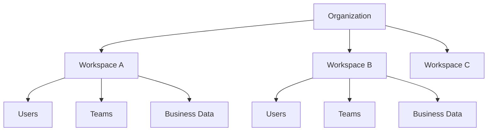

# Organization

> *"The Organization is the highest ownership boundary in Clara."*

---

# Purpose

This chapter defines the Organization concept within Clara.

An Organization represents the business entity that owns users, workspaces, data, workflows, configuration, integrations, billing, governance, and security policies.

---

# Overview

Every Clara deployment begins with an Organization.

An Organization may represent a company, institution, agency, community, or operational entity using Clara to run business processes.

Most platform resources should be traceable to an Organization directly or indirectly.

---

# Organization Responsibilities

An Organization owns:

- Workspaces.
- Users.
- Roles.
- Permissions.
- Teams.
- Departments.
- Customers.
- Workflows.
- Knowledge.
- Integrations.
- Billing settings.
- Security policies.
- Audit history.

---

# Organization Structure

---

# Organization Boundary

The Organization is a business boundary.

It defines ownership and accountability.

No user, AI agent, integration, workflow, plugin, or service should access Organization-owned data without authorization.

---

# Security Considerations

Organization boundaries are security-sensitive.

Clara must enforce:

- Authentication.
- Authorization.
- Tenant isolation.
- Workspace isolation.
- Audit logging.
- Least privilege.
- Secure configuration.

Client-provided Organization identifiers must never be trusted without server-side validation.

---

# Key Takeaways

- Organization is the highest business ownership boundary.
- Most Clara resources belong to an Organization.
- Organization boundaries influence security, billing, governance, and data ownership.
- Every cross-Organization access must be explicitly authorized.

---

# Related Documents

- ../../glossary/Organization.md
- ../../glossary/Workspace.md
- ../../glossary/User.md
- ../../standards/SECURITY-DOCS-STANDARD.md

---

# Navigation

**Previous:** README.md

**Next:** 12-Workspace.md
