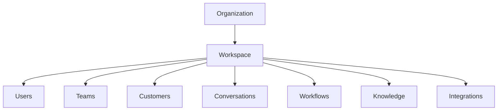

# Workspace

> *"A Workspace is where day-to-day work happens inside an Organization."*

---

# Purpose

This chapter defines Workspace as the operational environment within an Organization.

A Workspace groups users, teams, business data, workflows, settings, integrations, and AI capabilities for a specific operational purpose.

---

# Overview

An Organization may contain one or more Workspaces.

Small organizations may use one Workspace.

Larger organizations may separate Workspaces by department, region, product line, branch, or business function.

---

# Workspace Structure

---

# Workspace Responsibilities

A Workspace may contain:

- Users.
- Teams.
- Customers.
- Conversations.
- Tickets.
- Workflows.
- Knowledge.
- Dashboards.
- Integrations.
- Settings.
- AI agents.

---

# Workspace Isolation

Workspace boundaries help control access.

A user who belongs to one Workspace should not automatically access another Workspace unless assigned and authorized.

Workspace access should always be checked server-side.

---

# Workspace Examples

Examples:

- Sales Workspace.
- Support Workspace.
- Marketing Workspace.
- HR Workspace.
- Indonesia Region Workspace.
- Enterprise Customer Workspace.

---

# Security Considerations

Athena must enforce:

- Workspace membership.
- Workspace-scoped permissions.
- Workspace-level data access.
- Workspace audit events.
- Organization-level policy inheritance.

---

# Key Takeaways

- Workspace is the operational unit inside an Organization.
- Workspaces help structure business operations.
- Workspace boundaries support access control and data organization.
- Workspace access must be explicitly authorized.

---

# Related Documents

- ../../glossary/Workspace.md
- ../../glossary/Organization.md
- ../../glossary/User.md

---

# Navigation

**Previous:** 11-Organization.md

**Next:** 13-Departments.md
