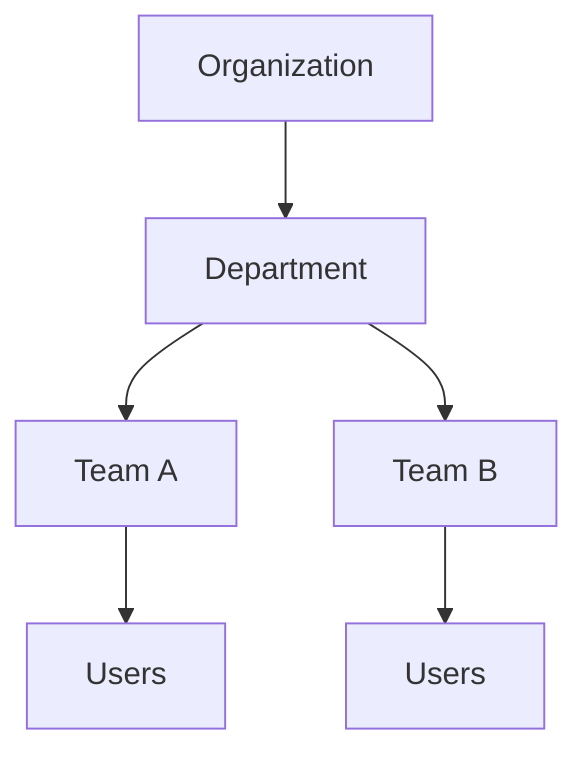

# Departments

> *"Departments represent business functions within an Organization."*

---

# Purpose

This chapter defines Departments as high-level business groupings within Athena.

Departments help organizations map business structure into platform structure.

---

# Overview

A Department represents a business function such as Sales, Support, Finance, HR, Operations, Marketing, or Engineering.

Departments may contain Teams and Users.

They may also influence reporting, workflow ownership, permission grouping, and governance.

---

# Department Structure

---

# Department Responsibilities

Departments may help organize:

- Teams.
- Users.
- Reporting lines.
- Workflow ownership.
- Business KPIs.
- Access policies.
- Operational dashboards.

---

# Departments vs Workspaces

A Workspace is an operational environment.

A Department is a business function.

One Workspace may contain multiple Departments.

One Department may operate across multiple Workspaces depending on organization design.

---

# Example Departments

- Sales.
- Customer Support.
- Finance.
- Marketing.
- HR.
- Operations.
- Engineering.
- Legal.
- Security.

---

# Security Considerations

Departments may influence access but should not replace explicit permissions.

Department membership alone should not grant sensitive access unless mapped through roles and permissions.

---

# Key Takeaways

- Departments represent business functions.
- Departments help structure reporting and ownership.
- Departments may contain Teams.
- Access must still be controlled through roles and permissions.

---

# Related Documents

- ../../glossary/Organization.md
- ../../glossary/Workspace.md
- ./14-Teams.md

---

# Navigation

**Previous:** 12-Workspace.md

**Next:** 14-Teams.md
