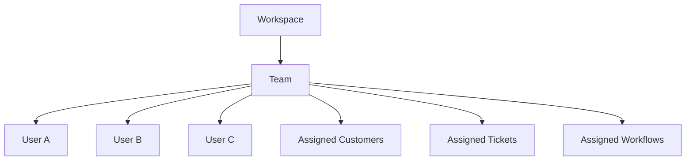

# Teams

> *"Teams organize collaboration and operational ownership."*

---

# Purpose

This chapter defines Teams within Athena.

Teams represent groups of Users working together around a shared responsibility, function, workflow, customer segment, product area, or operational objective.

---

# Overview

Teams provide a practical structure for collaboration.

They may be used for assignment, workflow routing, notifications, reporting, and ownership.

---

# Team Structure

---

# Team Responsibilities

Teams may own:

- Customer segments.
- Ticket queues.
- Workflow approvals.
- Sales pipelines.
- Support channels.
- Knowledge areas.
- Operational dashboards.

---

# Team Membership

A User may belong to multiple Teams.

Team membership should not automatically grant all permissions.

Permissions should be assigned through roles, policies, or scoped grants.

---

# Example Teams

- Tier 1 Support.
- Enterprise Sales.
- Billing Operations.
- AI Review Team.
- Customer Success.
- Security Response.
- Onboarding Team.

---

# Security Considerations

Team-based access must still respect authorization rules.

Team membership should be auditable.

Sensitive Team changes should create audit events.

---

# Key Takeaways

- Teams organize collaboration and ownership.
- Teams may support routing, assignment, reporting, and workflow ownership.
- Team membership should not bypass explicit permissions.
- Team changes should be auditable.

---

# Related Documents

- ./13-Departments.md
- ../../glossary/User.md
- ../../glossary/Permission.md

---

# Navigation

**Previous:** 13-Departments.md

**Next:** 15-Users.md
