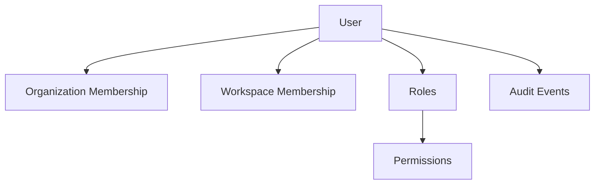
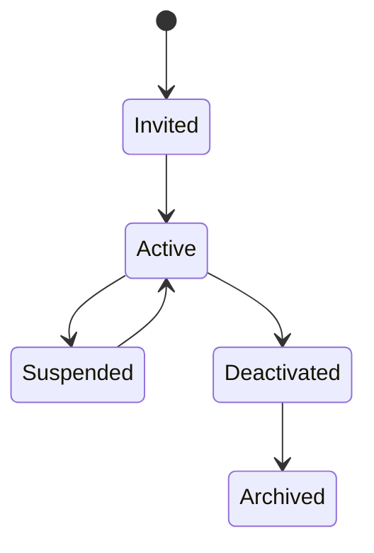

# Users

> *"A User is an accountable human identity in Clara."*

---

# Purpose

This chapter defines Users as human identities that interact with Clara.

Users perform work, manage resources, approve actions, collaborate with AI, and remain accountable for their actions.

---

# Overview

A User may belong to one or more Organizations and Workspaces.

Access depends on membership, roles, permissions, and policies.

A User represents a real human, not an automated system.

Automated actors should be modeled separately as service accounts, integrations, or AI agents.

---

# User Relationship Map

---

# User Lifecycle

A User may move through these states:

---

# User Responsibilities

Users may:

- Manage customers.
- Reply to conversations.
- Handle tickets.
- Configure workflows.
- Review AI recommendations.
- Approve sensitive actions.
- Manage integrations.
- View analytics.
- Administer workspaces.

---

# Security Considerations

User identity must be protected through:

- Authentication.
- Authorization.
- Session management.
- Least privilege.
- Audit logging.
- Account lifecycle controls.
- Multi-factor authentication where appropriate.

---

# Key Takeaways

- Users represent accountable human actors.
- Users may belong to multiple Organizations or Workspaces.
- User access is determined by roles, permissions, and policies.
- User lifecycle changes must be auditable.

---

# Related Documents

- ../../glossary/User.md
- ../../glossary/Role.md
- ../../glossary/Permission.md

---

# Navigation

**Previous:** 14-Teams.md

**Next:** 16-Identity.md
