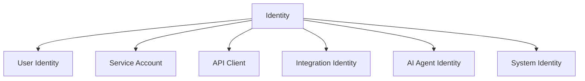

# Identity

> *"Identity is the foundation of trust in Clara."*

---

# Purpose

This chapter defines Identity as the representation of an actor that can interact with Clara.

Identity is the foundation for authentication, authorization, auditability, and accountability.

---

# Overview

Clara may support several identity types:

- Human User.
- Service Account.
- API Client.
- Integration Identity.
- AI Agent Identity.
- System Identity.

Each identity type must have clear ownership, scope, and permissions.

---

# Identity Map

---

# Identity Principles

Identity should be:

- Unique.
- Verifiable.
- Scoped.
- Auditable.
- Revocable.
- Governed.
- Least-privileged.

---

# Identity and AI

AI agents may need identities to perform actions.

An AI Agent identity must not bypass permissions.

It should operate through delegated permissions or explicitly granted service permissions.

---

# Identity and Audit

Every meaningful action should be attributable to an identity.

Audit records should capture:

- Actor identity.
- Action.
- Resource.
- Scope.
- Timestamp.
- Result.

---

# Security Considerations

Identity must be protected from:

- Impersonation.
- Credential theft.
- Session hijacking.
- Privilege escalation.
- Unscoped service accounts.
- Uncontrolled AI tool access.

---

# Key Takeaways

- Identity represents actors in Clara.
- Identity supports trust, access, and auditability.
- Human and non-human identities should be modeled clearly.
- AI identities must remain governed.

---

# Related Documents

- ../../glossary/User.md
- ../../glossary/Agent.md
- ./17-Authentication.md
- ./18-Authorization.md

---

# Navigation

**Previous:** 15-Users.md

**Next:** 17-Authentication.md
