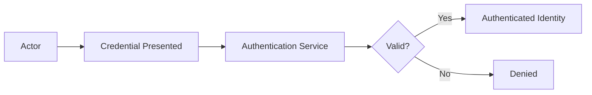

# Authentication

> *"Authentication proves identity before access is evaluated."*

---

# Purpose

This chapter defines Authentication in Athena.

Authentication verifies that an actor is who they claim to be.

---

# Overview

Athena may support authentication for:

- Users.
- Service accounts.
- API clients.
- Integrations.
- AI agents.
- Internal services.

Authentication does not decide what an identity may access.

That responsibility belongs to Authorization.

---

# Authentication Flow

---

# Authentication Methods

Possible authentication methods include:

- Email and password.
- Single Sign-On.
- OAuth.
- Magic link.
- API keys.
- Service tokens.
- Session cookies.
- Multi-factor authentication.

Final methods should be defined in security architecture and implementation documents.

---

# Session Management

Authenticated sessions should be:

- Secure.
- Expirable.
- Revocable.
- Auditable.
- Protected against hijacking.
- Bound by policy where appropriate.

---

# Security Considerations

Authentication must protect against:

- Credential stuffing.
- Brute force attacks.
- Session fixation.
- Token theft.
- Weak passwords.
- Replay attacks.
- Phishing risks.

---

# Key Takeaways

- Authentication proves identity.
- Authentication is required before authorization.
- Different actor types may use different authentication methods.
- Authentication events should be auditable.

---

# Related Documents

- ./16-Identity.md
- ./18-Authorization.md
- ../../standards/SECURITY-DOCS-STANDARD.md

---

# Navigation

**Previous:** 16-Identity.md

**Next:** 18-Authorization.md
