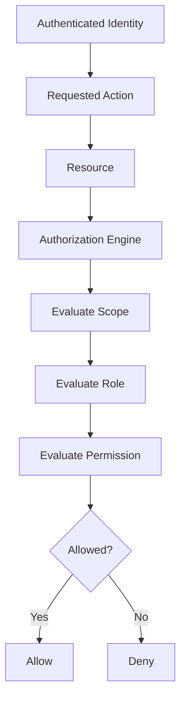

# Authorization

> *"Authorization decides what an authenticated identity is allowed to do."*

---

# Purpose

This chapter defines Authorization in Clara.

Authorization determines whether an authenticated identity may perform an action on a resource within a scope.

---

# Overview

Authorization evaluates:

- Identity.
- Organization.
- Workspace.
- Role assignments.
- Permissions.
- Policies.
- Resource ownership.
- Context.
- Risk.

Authorization must be enforced server-side.

---

# Authorization Flow

---

# Authorization Principles

Clara authorization should follow:

- Deny by default.
- Least privilege.
- Server-side enforcement.
- Scoped access.
- Explicit permissions.
- Auditability.
- Clear error behavior.

---

# Scope

Authorization decisions may be scoped to:

- Organization.
- Workspace.
- Team.
- Resource.
- System.

A permission in one scope should not automatically apply in another scope.

---

# AI Authorization

AI agents must not bypass authorization.

AI access should be controlled through:

- Delegated user permissions.
- Explicit service permissions.
- Tool-level authorization.
- Context filtering.
- Audit logging.

---

# Security Considerations

Authorization failures should not leak sensitive information.

Sensitive actions should require stronger controls.

Examples:

- Role changes.
- Permission grants.
- Data export.
- Plugin installation.
- Billing changes.
- Destructive actions.

---

# Key Takeaways

- Authorization happens after authentication.
- Access must be checked server-side.
- Authorization uses roles, permissions, scope, policies, and resource ownership.
- AI capabilities must follow the same authorization model.

---

# Related Documents

- ./17-Authentication.md
- ./19-Roles.md
- ./20-Permissions.md
- ../../glossary/Permission.md

---

# Navigation

**Previous:** 17-Authentication.md

**Next:** 19-Roles.md
