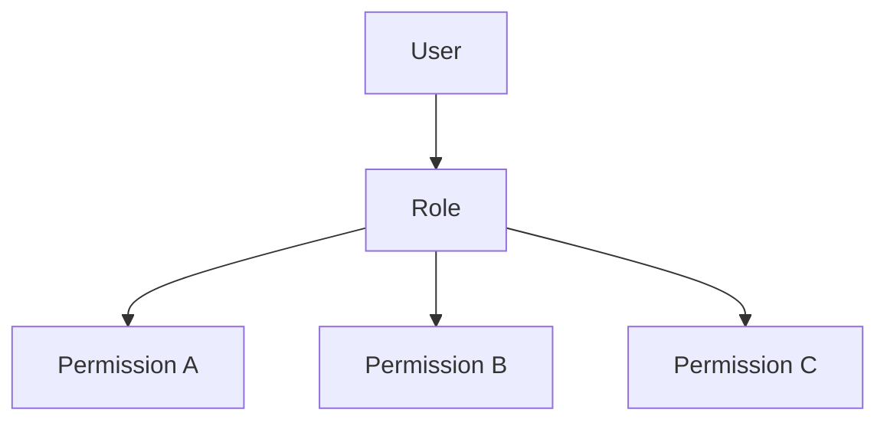
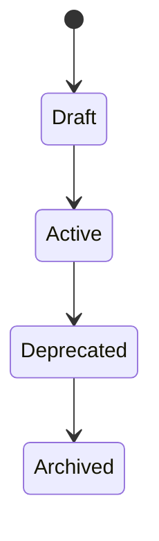

# Roles

> *"Roles group responsibilities into manageable access patterns."*

---

# Purpose

This chapter defines Roles in Clara.

Roles group permissions into meaningful responsibility sets.

They make access easier to manage and understand.

---

# Overview

A Role may be assigned to a User, Service Account, or AI Agent within a scope.

Roles should represent responsibility.

Permissions should represent allowed actions.

---

# Role Map

---

# Role Types

Clara may support:

- System Roles.
- Custom Roles.
- Organization Roles.
- Workspace Roles.
- Team Roles.
- Temporary Roles.

---

# Example Roles

Examples:

- Owner.
- Admin.
- Workspace Admin.
- Manager.
- Agent.
- Analyst.
- Developer.
- Billing Admin.
- Security Reviewer.
- Viewer.

---

# Role Design Principles

Roles should be:

- Understandable.
- Scoped.
- Auditable.
- Least-privileged.
- Consistent.
- Reviewable.
- Replaceable.

---

# Role Lifecycle

---

# Security Considerations

Role assignment is security-sensitive.

Clara should audit:

- Role created.
- Role updated.
- Role assigned.
- Role removed.
- Role deprecated.
- Permission added to Role.
- Permission removed from Role.

---

# Key Takeaways

- Roles group responsibilities.
- Roles grant permissions through scoped assignments.
- Roles should not be overly broad.
- Role changes should be auditable.

---

# Related Documents

- ../../glossary/Role.md
- ../../glossary/Permission.md
- ./18-Authorization.md

---

# Navigation

**Previous:** 18-Authorization.md

**Next:** 20-Permissions.md
