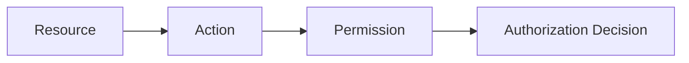

# Permissions

> *"Permissions define the smallest unit of allowed action."*

---

# Purpose

This chapter defines Permissions in Clara.

Permissions are the granular access controls used during authorization.

---

# Overview

A Permission represents an allowed action on a protected resource.

Clara recommends the format:

```text
<resource>:<action>
```

Examples:

```text
customer:read
customer:create
customer:update
conversation:reply
ticket:update
workflow:execute
role:manage
```

---

# Permission Structure



---

# Permission Scope

Permissions may be scoped to:

- Organization.
- Workspace.
- Team.
- Resource.
- System.

Scope determines where the permission applies.

---

# Permission Evaluation

Authorization should evaluate:

- Identity.
- Scope.
- Role assignments.
- Direct permissions.
- Policies.
- Resource ownership.
- Request context.

---

# Permission Examples

| Permission | Meaning |
|---|---|
| customer:read | View customer records |
| customer:update | Update customer records |
| conversation:reply | Send replies in conversations |
| ticket:update | Modify tickets |
| workflow:execute | Execute workflows |
| role:manage | Manage roles |

---

# Security Considerations

Permissions are security-critical.

Clara should:

- Deny by default.
- Validate permissions server-side.
- Avoid wildcard permissions for normal users.
- Audit privileged permission usage.
- Review permissions periodically.

---

# Key Takeaways

- Permissions are the smallest authorization unit.
- Roles group permissions.
- Permissions must be scoped.
- Permission checks must happen server-side.
- Permissions protect Organization and Workspace boundaries.

---

# Related Documents

- ../../glossary/Permission.md
- ../../glossary/Role.md
- ./18-Authorization.md
- ../../standards/SECURITY-DOCS-STANDARD.md

---

# Navigation

**Previous:** 19-Roles.md

**Next:** ../PART-03-Business-Domains/21-CRM.md
