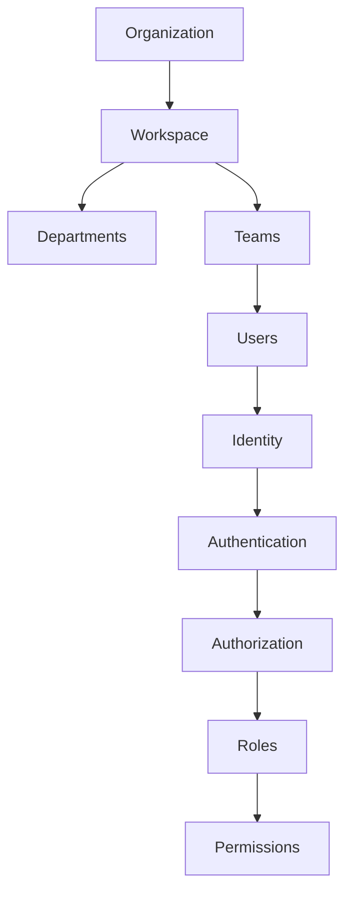

# PART-02 — Organization Layer

> *"Everything in Athena begins with the Organization."*

---

# Purpose

Part II defines the organizational foundation of Athena.

Before Athena can manage customers, workflows, AI agents, knowledge, integrations, billing, or analytics, it must define who owns the platform environment and how access is organized.

The Organization Layer establishes the foundation for ownership, identity, workspace structure, access control, governance, and multi-tenancy.

---

# Goals

- Define Organization as the highest business ownership boundary.
- Define Workspace as the operational environment inside an Organization.
- Establish the identity and user model.
- Define Role-Based Access Control and Permission concepts.
- Explain team structure and organizational hierarchy.
- Define multi-tenancy at the blueprint level.
- Establish governance principles for Organization-level administration.

---

# Scope

## In Scope

- Organization.
- Workspace.
- Identity.
- User lifecycle.
- Roles.
- Permissions.
- Teams.
- Multi-tenancy.
- Governance.

## Out of Scope

- Final database schema.
- Final API contracts.
- Detailed IAM implementation.
- Cloud-specific tenant isolation.
- Production deployment architecture.

Those topics belong in later architecture and implementation documents.

---

# Chapter Map

| Chapter | Title | Purpose |
|---|---|---|
| 11 | Organization | Defines Organization as the highest business boundary |
| 12 | Workspace | Defines Workspace as the operational environment |
| 13 | Departments | Defines departments as business grouping units |
| 14 | Teams | Defines teams as collaboration and ownership units |
| 15 | Users | Defines human identities in Athena |
| 16 | Identity | Defines identity as the basis of platform access |
| 17 | Authentication | Defines how identities prove who they are |
| 18 | Authorization | Defines how access decisions are made |
| 19 | Roles | Defines grouped responsibilities |
| 20 | Permissions | Defines granular access rights |

---

# Organization Layer Map

---

# Related Documents

- ../../BOOK-01-The-Foundation/11-Security-Philosophy.md
- ../../BOOK-01-The-Foundation/12-Architecture-Principles.md
- ../../glossary/Organization.md
- ../../glossary/Workspace.md
- ../../glossary/User.md
- ../../glossary/Role.md
- ../../glossary/Permission.md

---

# Navigation

**Previous:** ../PART-01-Platform-Vision/10-Future-Vision.md

**Next:** 11-Organization.md
