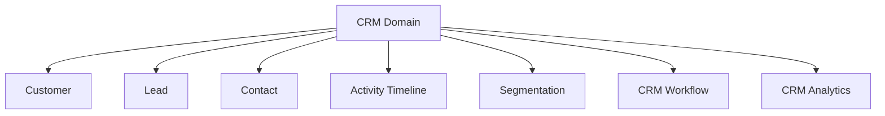

# CRM

> *"CRM is the relationship layer between an organization and the people it serves."*

---

# Purpose

This chapter defines the CRM domain in Athena.

CRM provides the foundation for managing customer relationships, leads, contacts, communication history, sales activity, customer context, and relationship-driven workflows.

---

# Overview

The CRM domain is not only a contact database.

In Athena, CRM is the domain that connects customer identity, conversations, sales activity, support history, workflow automation, AI context, and analytics.

CRM should become the relationship memory of an Organization.

---

# Core Responsibilities

The CRM domain may own or coordinate:

- Customer records.
- Lead records.
- Contact information.
- Relationship timeline.
- Customer segmentation.
- Ownership assignment.
- Notes and activities.
- Interaction history.
- CRM workflows.
- Relationship analytics.

---

# Domain Map

---

# Relationship to Other Domains

CRM connects strongly with:

- Communication.
- Inbox.
- Customer Support.
- Sales.
- Marketing.
- Billing.
- Analytics.
- AI Platform.
- Workflow.

---

# AI Opportunities

AI may assist CRM by:

- Summarizing customer history.
- Detecting customer intent.
- Recommending next actions.
- Scoring leads.
- Extracting contact information.
- Identifying churn risk.
- Drafting follow-up messages.

---

# Security Considerations

CRM data is business-sensitive.

Access should be controlled by Organization, Workspace, Role, and Permission.

Sensitive customer data exports must be auditable.

---

# Key Takeaways

- CRM is the relationship foundation of Athena.
- CRM connects customer data with communication, workflow, AI, and analytics.
- CRM should preserve long-term relationship context.
- CRM data must be protected by strong authorization.

---

# Related Documents

- ../../glossary/Customer.md
- ../../glossary/Lead.md
- ../../glossary/Conversation.md
