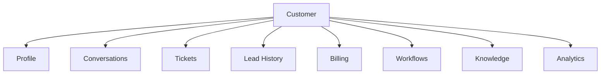
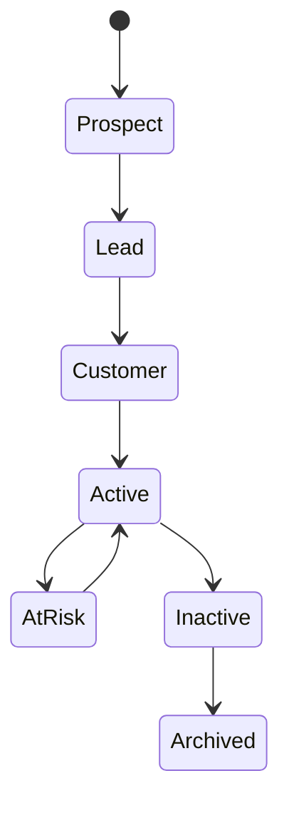

# Customer

> *"The Customer is the central external relationship managed by Athena."*

---

# Purpose

This chapter defines the Customer domain blueprint.

The Customer domain represents external people, companies, clients, subscribers, patients, students, citizens, or service recipients that an Organization manages through Athena.

---

# Overview

Customer is one of Athena's most important business entities.

Many domains connect back to Customer:

- CRM.
- Communication.
- Support.
- Sales.
- Marketing.
- Billing.
- Analytics.
- AI.

Customer context should be consistent across the platform.

---

# Core Responsibilities

The Customer domain may own:

- Customer profile.
- Customer lifecycle.
- Customer status.
- Customer ownership.
- Customer segmentation.
- Customer preferences.
- Customer relationship timeline.
- Customer custom attributes.

---

# Customer Context Map

---

# Customer Lifecycle

---

# AI Opportunities

AI may assist by:

- Creating customer summaries.
- Extracting structured customer data.
- Suggesting next actions.
- Identifying risks.
- Personalizing replies.
- Detecting duplicate customers.

---

# Security Considerations

Customer data may include personal and sensitive business information.

Athena must enforce access control, auditability, tenant isolation, workspace isolation, and secure export rules.

---

# Key Takeaways

- Customer is a core business entity.
- Customer context should connect across domains.
- Customer data must have clear ownership.
- AI access to customer data must be authorized.

---

# Related Documents

- ../../glossary/Customer.md
- ../../glossary/Conversation.md
- ../../glossary/Ticket.md
