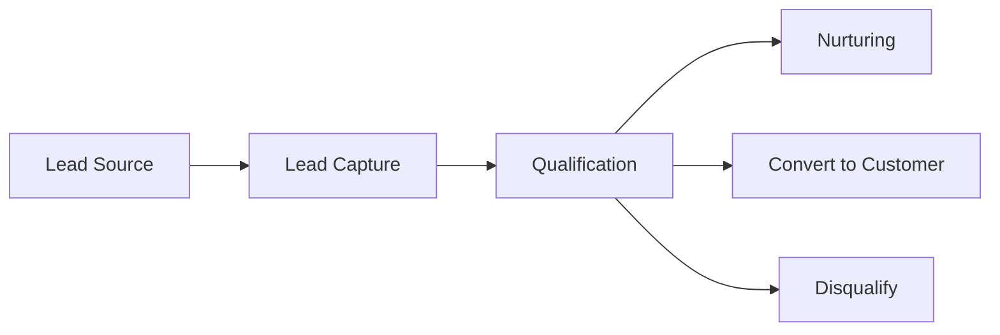

# Leads

> *"A Lead represents potential business value before a customer relationship is established."*

---

# Purpose

This chapter defines the Leads domain blueprint.

Leads support acquisition, qualification, nurturing, and conversion into customers.

---

# Overview

The Leads domain helps organizations manage potential relationships before they become customers.

A Lead may originate from forms, conversations, campaigns, referrals, imports, or integrations.

---

# Core Responsibilities

The Leads domain may own:

- Lead profile.
- Lead source.
- Lead status.
- Lead score.
- Lead owner.
- Lead lifecycle.
- Qualification rules.
- Conversion to Customer.
- Lead activity timeline.

---

# Lead Flow

---

# Relationship to Marketing and Sales

Marketing often creates or nurtures leads.

Sales qualifies and converts leads.

CRM preserves the relationship context.

---

# AI Opportunities

AI may assist by:

- Lead scoring.
- Intent detection.
- Data enrichment.
- Follow-up drafting.
- Qualification suggestions.
- Duplicate detection.

---

# Security Considerations

Lead data may contain personal information and sales-sensitive information.

Access should follow workspace and permission rules.

---

# Key Takeaways

- Leads represent potential relationships.
- Leads may convert into Customers.
- Source attribution should be preserved.
- AI can assist qualification but should not replace business judgment.

---

# Related Documents

- ../../glossary/Lead.md
- ../../glossary/Customer.md
