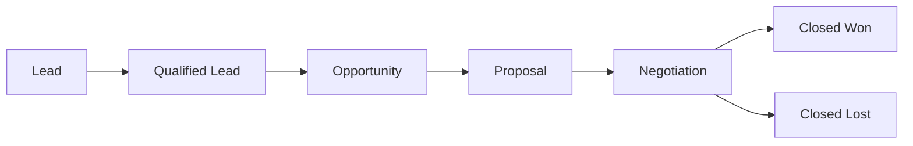

# Sales

> *"Sales turns qualified opportunity into business value."*

---

# Purpose

This chapter defines the Sales domain blueprint.

Sales supports pipeline management, opportunity tracking, follow-up, forecasting, relationship management, and conversion workflows.

---

# Overview

The Sales domain builds on CRM, Leads, Customers, Communication, Tasks, Calendar, and Analytics.

It helps teams manage commercial progress from interest to closed outcome.

---

# Core Responsibilities

The Sales domain may own:

- Sales pipeline.
- Opportunity records.
- Deal stages.
- Sales activities.
- Follow-up tasks.
- Forecasting.
- Sales ownership.
- Conversion workflows.
- Sales reporting.

---

# Sales Flow

---

# AI Opportunities

AI may assist by:

- Summarizing sales conversations.
- Recommending next actions.
- Detecting deal risk.
- Drafting follow-ups.
- Forecasting probability.
- Highlighting missing information.

---

# Security Considerations

Sales data may be commercially sensitive.

Deal visibility, pipeline access, and forecasting data should be permission-controlled.

---

# Key Takeaways

- Sales builds on Lead and Customer domains.
- Sales should preserve deal context and activity history.
- Sales workflows should be measurable.
- AI can support but not own commercial decisions.

---

# Related Documents

- ../../glossary/Lead.md
- ../../glossary/Customer.md
- ./23-Leads.md
