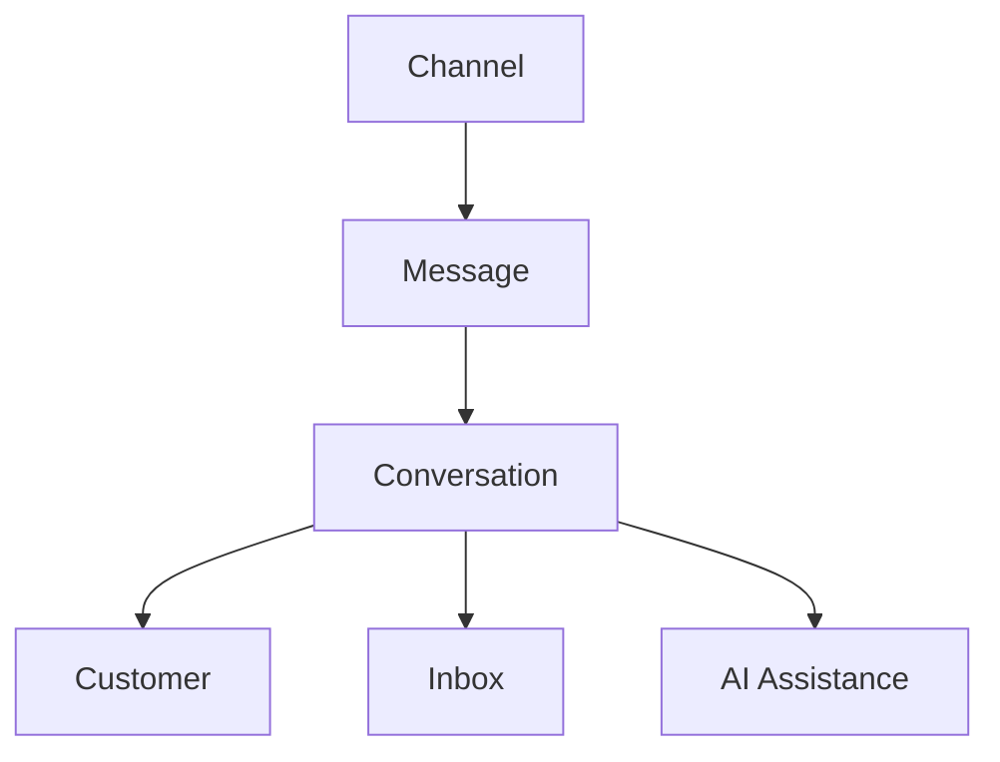

# Communication

> *"Communication is the connective tissue between organizations and the people they serve."*

---

# Purpose

This chapter defines the Communication domain blueprint.

Communication handles message exchange, channels, participants, conversation context, delivery state, and communication history.

---

# Overview

Athena communication should support omnichannel interactions.

Channels may include email, live chat, WhatsApp, Instagram, TikTok, Telegram, SMS, voice, and future connectors.

---

# Core Responsibilities

The Communication domain may own:

- Conversations.
- Messages.
- Participants.
- Channels.
- Attachments.
- Delivery status.
- Internal notes.
- Message metadata.
- Communication events.

---

# Communication Map

---

# AI Opportunities

AI may assist by:

- Summarizing conversations.
- Suggesting replies.
- Detecting sentiment.
- Translating messages.
- Extracting structured data.
- Classifying intent.

---

# Security Considerations

Communication data can contain sensitive customer information.

Access, retention, export, and AI retrieval must be governed.

---

# Key Takeaways

- Communication is a core platform capability.
- Conversations preserve interaction history.
- Channels should be unified without losing source metadata.
- AI assistance must remain auditable.

---

# Related Documents

- ../../glossary/Conversation.md
- ./27-Inbox.md
