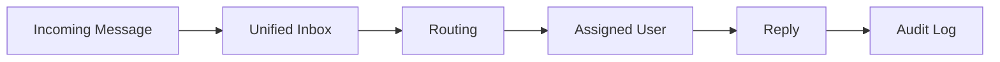

# Inbox

> *"The Inbox turns communication into operational work."*

---

# Purpose

This chapter defines the Inbox domain blueprint.

Inbox provides a unified operational interface for handling conversations, assignments, statuses, priorities, and collaboration.

---

# Overview

The Inbox domain builds on Communication.

It helps teams manage incoming messages across channels in one workflow-oriented environment.

---

# Core Responsibilities

The Inbox domain may own:

- Conversation queues.
- Assignment.
- Status.
- Priority.
- Tags.
- Filters.
- Internal notes.
- Team routing.
- SLA indicators.
- AI reply review.

---

# Inbox Flow

---

# AI Opportunities

AI may assist by:

- Categorizing messages.
- Routing conversations.
- Suggesting replies.
- Detecting urgency.
- Summarizing history.
- Escalating low-confidence cases.

---

# Security Considerations

Inbox access must respect workspace, team, and permission boundaries.

Internal notes should be protected from customer-facing channels.

---

# Key Takeaways

- Inbox operationalizes conversations.
- Inbox connects Communication, Customer Support, AI, and Workflow.
- Routing and assignment should be auditable.
- AI assistance should support human review.

---

# Related Documents

- ./26-Communication.md
- ../../glossary/Conversation.md
