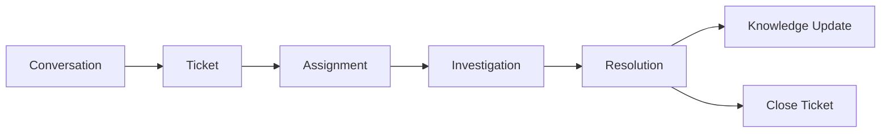

# Customer Support

> *"Customer Support resolves issues while building organizational knowledge."*

---

# Purpose

This chapter defines the Customer Support domain blueprint.

Customer Support manages tickets, service requests, incidents, SLAs, assignments, escalations, resolutions, and support knowledge.

---

# Overview

Customer Support connects Customer, Conversation, Ticket, Knowledge, Workflow, AI, Analytics, and Notification capabilities.

---

# Core Responsibilities

The Customer Support domain may own:

- Tickets.
- Ticket lifecycle.
- SLA management.
- Assignment rules.
- Escalation.
- Resolution.
- Support notes.
- Support analytics.
- Customer satisfaction.

---

# Support Flow

---

# AI Opportunities

AI may assist by:

- Ticket classification.
- Priority prediction.
- Duplicate detection.
- Knowledge article suggestions.
- Response drafting.
- Resolution summaries.
- SLA risk detection.

---

# Security Considerations

Support data may include sensitive customer information and internal notes.

Access must be controlled and auditable.

---

# Key Takeaways

- Support turns customer issues into trackable work.
- Tickets provide accountability.
- Resolutions should feed Knowledge.
- AI can improve speed and consistency.

---

# Related Documents

- ../../glossary/Ticket.md
- ../../glossary/Customer.md
- ./29-Knowledge.md
