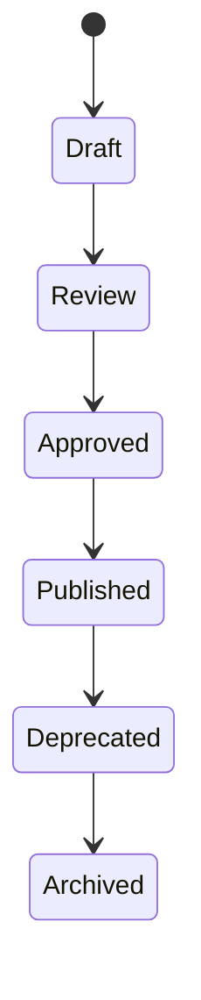

# Documents

> *"Documents are structured artifacts that preserve business knowledge, evidence, and process state."*

---

# Purpose

This chapter defines the Documents domain blueprint.

Documents support storage, organization, indexing, sharing, review, approval, and lifecycle management of business files and written artifacts.

---

# Overview

Documents may include contracts, policies, reports, proposals, invoices, knowledge articles, specifications, images, attachments, and operational records.

---

# Core Responsibilities

The Documents domain may own:

- Document metadata.
- File attachment references.
- Document lifecycle.
- Review status.
- Approval workflow.
- Version history.
- Access control.
- Search indexing.
- Document classification.

---

# Document Lifecycle

---

# Relationship to Knowledge

Some documents become knowledge sources.

Not every document should automatically become trusted Knowledge.

Business-critical documents may require review before indexing for AI retrieval.

---

# AI Opportunities

AI may assist by:

- Summarization.
- Classification.
- Metadata extraction.
- Search.
- Document comparison.
- Draft generation.
- Policy question answering.

---

# Security Considerations

Documents may contain sensitive data.

Access control, retention, encryption, audit logging, and export control are required.

---

# Key Takeaways

- Documents preserve business artifacts.
- Documents may feed Knowledge after review.
- Document lifecycle must be explicit.
- AI access must respect permissions.

---

# Related Documents

- ./29-Knowledge.md
- ../../glossary/Knowledge.md
