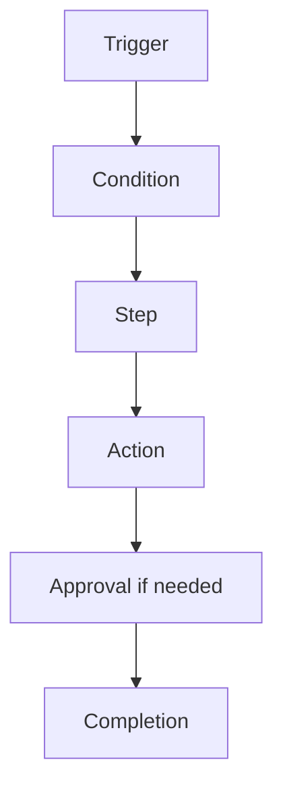

# Workflow

> *"Workflow turns business process into repeatable execution."*

---

# Purpose

This chapter defines the Workflow domain blueprint.

Workflow coordinates structured business processes across users, services, AI agents, events, approvals, tasks, and integrations.

---

# Overview

Workflows help Clara move work from one state to another.

They may be manually started, event-triggered, scheduled, or initiated by AI-assisted recommendations.

---

# Core Responsibilities

The Workflow domain may own:

- Workflow definitions.
- Workflow versions.
- Workflow executions.
- Triggers.
- Conditions.
- Steps.
- Actions.
- Approvals.
- Error handling.
- Execution history.

---

# Workflow Map

---

# AI Opportunities

AI may assist by:

- Recommending workflows.
- Drafting workflow definitions.
- Classifying triggers.
- Suggesting next steps.
- Handling low-risk automation.
- Escalating uncertain cases.

---

# Security Considerations

Workflows may perform sensitive actions.

Each step must enforce authorization, auditability, and safe failure behavior.

---

# Key Takeaways

- Workflow coordinates business execution.
- Workflows should be observable and auditable.
- Workflow versions preserve execution history.
- AI can assist but must not bypass controls.

---

# Related Documents

- ../../glossary/Workflow.md
- ./32-Automation.md
