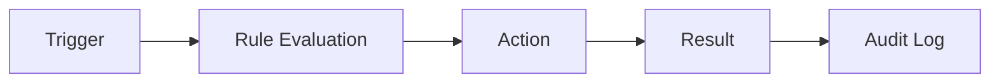

# Automation

> *"Automation executes repeatable work safely, consistently, and observably."*

---

# Purpose

This chapter defines the Automation domain blueprint.

Automation reduces manual work by executing predefined actions based on triggers, rules, schedules, events, or workflow steps.

---

# Overview

Automation is different from Workflow.

Workflow defines the process.

Automation executes repeatable steps within or around that process.

---

# Core Responsibilities

The Automation domain may own:

- Automation rules.
- Triggers.
- Conditions.
- Actions.
- Schedules.
- Execution logs.
- Retry behavior.
- Failure handling.
- Automation approvals.

---

# Automation Flow

---

# AI Opportunities

AI may assist by:

- Suggesting automation rules.
- Detecting repetitive work.
- Explaining automation outcomes.
- Classifying automation failures.
- Recommending safe next actions.

---

# Security Considerations

Automation must never bypass authorization.

Destructive or sensitive automation should require approval, strong permissions, and audit logging.

---

# Key Takeaways

- Automation executes repeatable work.
- Automation should remain safe and observable.
- Workflow and Automation are related but distinct.
- AI can recommend automation but governance is required.

---

# Related Documents

- ./31-Workflow.md
- ../../glossary/Workflow.md
