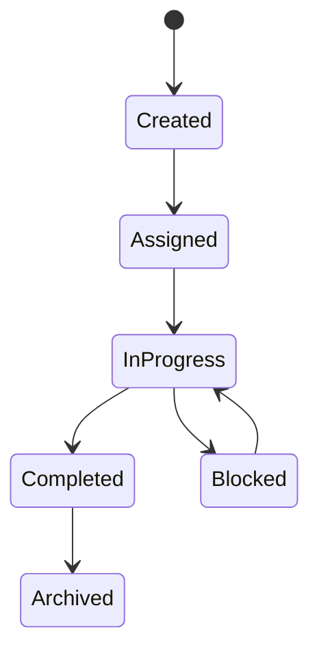

# Tasks

> *"A task is a concrete unit of work that someone or something must complete."*

---

# Purpose

This chapter defines the Tasks domain blueprint.

Tasks represent actionable work assigned to users, teams, workflows, AI agents, or automation.

---

# Overview

Tasks help Clara coordinate operational work across CRM, Support, Sales, Projects, Workflow, and Calendar.

---

# Core Responsibilities

The Tasks domain may own:

- Task records.
- Task status.
- Task assignment.
- Due dates.
- Priority.
- Reminders.
- Dependencies.
- Completion history.
- Task comments.

---

# Task Lifecycle

---

# AI Opportunities

AI may assist by:

- Creating tasks from conversations.
- Recommending due dates.
- Summarizing task context.
- Detecting overdue tasks.
- Suggesting owners.
- Generating task checklists.

---

# Security Considerations

Task visibility should respect workspace, team, and resource permissions.

Tasks may reference sensitive customer or internal data.

---

# Key Takeaways

- Tasks are concrete work units.
- Tasks may be created manually, by workflows, or by automation.
- Task ownership and lifecycle should be clear.
- AI can help create and prioritize tasks.

---

# Related Documents

- ./31-Workflow.md
- ./34-Projects.md
