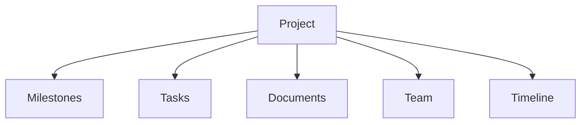

# Projects

> *"A project coordinates multiple tasks toward a larger outcome."*

---

# Purpose

This chapter defines the Projects domain blueprint.

Projects help teams plan, organize, track, and complete larger initiatives.

---

# Overview

Projects group tasks, milestones, owners, timelines, documents, conversations, and status updates.

A Project may represent internal work, customer delivery, implementation, onboarding, migration, or strategic initiatives.

---

# Core Responsibilities

The Projects domain may own:

- Project records.
- Milestones.
- Task grouping.
- Ownership.
- Project status.
- Timeline.
- Dependencies.
- Project documents.
- Progress reporting.

---

# Project Structure

---

# AI Opportunities

AI may assist by:

- Summarizing project status.
- Identifying blockers.
- Creating task breakdowns.
- Drafting updates.
- Suggesting risks.
- Estimating timelines.

---

# Security Considerations

Project access should respect workspace, team, role, and permission rules.

Projects may contain sensitive internal or customer data.

---

# Key Takeaways

- Projects coordinate larger bodies of work.
- Projects depend on Tasks, Documents, Teams, and Calendar.
- Project visibility must be governed.
- AI can improve planning and reporting.

---

# Related Documents

- ./33-Tasks.md
- ./35-Calendar.md
