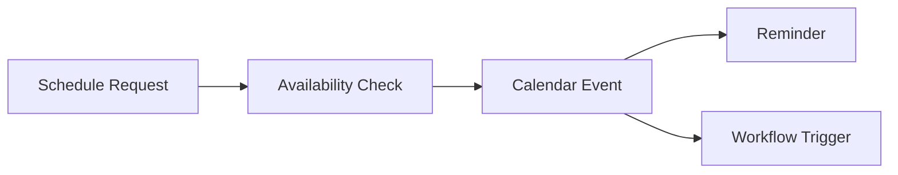

# Calendar

> *"Calendar coordinates time across people, work, and workflows."*

---

# Purpose

This chapter defines the Calendar domain blueprint.

Calendar supports scheduling, availability, reminders, meetings, deadlines, time-based workflows, and coordination across teams.

---

# Overview

Calendar connects with Tasks, Projects, Workflows, Sales, Support, and Notifications.

It provides the time dimension of work.

---

# Core Responsibilities

The Calendar domain may own:

- Events.
- Meetings.
- Availability.
- Reminders.
- Deadlines.
- Scheduling rules.
- Calendar integrations.
- Time-based triggers.

---

# Calendar Flow

---

# AI Opportunities

AI may assist by:

- Scheduling suggestions.
- Meeting summaries.
- Follow-up tasks.
- Deadline detection.
- Calendar conflict explanation.
- Time-aware workflow recommendations.

---

# Security Considerations

Calendar data may reveal sensitive business activity.

Access should be scoped and auditable.

---

# Key Takeaways

- Calendar represents the time layer of Athena.
- Calendar connects to tasks, workflows, reminders, and meetings.
- Calendar integrations require careful permissions.
- AI can assist with scheduling and follow-up.

---

# Related Documents

- ./33-Tasks.md
- ./31-Workflow.md
