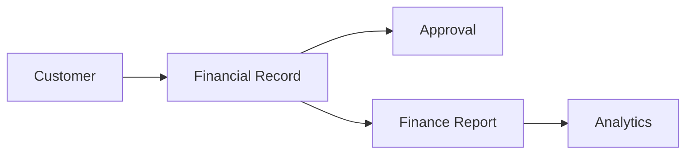

# Finance

> *"Finance provides business context for value, cost, and operational accountability."*

---

# Purpose

This chapter defines the Finance domain blueprint.

Finance supports financial context, payment-related records, cost awareness, revenue visibility, and operational financial reporting.

---

# Overview

Finance may connect with Billing, Customer, Sales, Analytics, Workflow, and Integrations.

In Clara, Finance should be treated carefully because it may involve sensitive and regulated data.

---

# Core Responsibilities

The Finance domain may coordinate:

- Financial records.
- Revenue context.
- Cost tracking.
- Payment status.
- Financial workflows.
- Approvals.
- Finance reporting.
- External finance integrations.

---

# Finance Flow

---

# AI Opportunities

AI may assist by:

- Summarizing financial activity.
- Detecting anomalies.
- Explaining billing issues.
- Drafting finance reports.
- Routing financial approvals.

---

# Security Considerations

Finance data is highly sensitive.

Access should require strict permissions, auditability, and secure export controls.

---

# Key Takeaways

- Finance provides value and cost context.
- Finance data must be protected carefully.
- Finance workflows often require approval.
- Finance integrates closely with Billing and Analytics.

---

# Related Documents

- ./38-Billing.md
- ./36-Analytics.md
