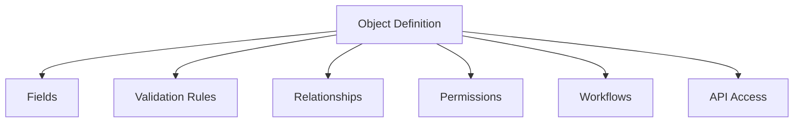

# Custom Objects

> *"Custom Objects allow Clara to adapt to business models that do not fit predefined domains."*

---

# Purpose

This chapter defines the Custom Objects domain blueprint.

Custom Objects allow organizations to define structured business entities beyond Clara's default domain model.

---

# Overview

Every organization has unique data.

Custom Objects allow Clara to support specialized business models without hardcoding every possible entity into the core platform.

---

# Core Responsibilities

The Custom Objects domain may own:

- Custom object definitions.
- Custom fields.
- Validation rules.
- Relationships.
- Permissions.
- Views.
- Import and export.
- Workflow integration.
- API exposure.

---

# Custom Object Map

---

# Example Custom Objects

Examples:

- Property.
- Vehicle.
- Course.
- Shipment.
- Medical Case.
- Vendor.
- Asset.
- Membership.
- Contract.

---

# AI Opportunities

AI may assist by:

- Suggesting object schemas.
- Extracting data into custom objects.
- Generating views.
- Explaining relationships.
- Creating workflows from object definitions.

---

# Security Considerations

Custom Objects must use the same authorization, audit, tenant isolation, and data protection principles as built-in domains.

Admins should not accidentally expose sensitive custom data.

---

# Key Takeaways

- Custom Objects make Clara extensible.
- Custom Objects should not bypass platform governance.
- Custom fields and relationships require clear ownership.
- AI can help design and use custom object models.

---

# Related Documents

- ../../glossary/Domain.md
- ../../glossary/Workflow.md
- ../../glossary/Plugin.md
