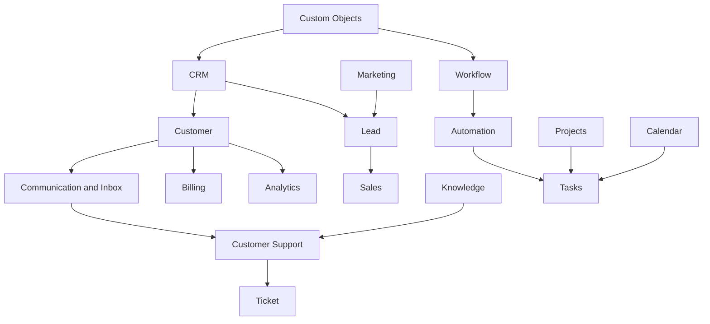

# PART-03 — Business Domains

> *"Business domains define what Clara helps an organization actually do."*

---

# Purpose

Part III defines the major business domains of Clara.

A business domain represents a distinct business capability area with clear ownership, language, data, workflows, and responsibilities.

This Part explains the domain-level blueprint for CRM, customers, leads, sales, marketing, communication, inbox, support, knowledge, documents, workflow, automation, tasks, projects, calendar, analytics, finance, billing, inventory, HR, and custom objects.

---

# Goals

- Define Clara's major business capability areas.
- Establish domain boundaries before implementation.
- Explain how domains relate to Organization, Workspace, Identity, and Permissions.
- Create a foundation for future PRDs, TDDs, API specs, and architecture documents.
- Prevent business logic from being scattered across unrelated services.

---

# Scope

## In Scope

- Business domain purpose.
- Core responsibilities.
- Domain relationships.
- High-level entities.
- AI opportunities.
- Security considerations.
- Future evolution.

## Out of Scope

- Final database schema.
- Final service boundaries.
- Final API contracts.
- UI wireframes.
- Detailed implementation.

---

# Chapter Map

| Chapter | Title | Purpose |
|---|---|---|
| 21 | CRM | Defines the customer relationship foundation |
| 22 | Customer | Defines the central customer entity |
| 23 | Leads | Defines potential business opportunities |
| 24 | Sales | Defines sales process support |
| 25 | Marketing | Defines audience and campaign capabilities |
| 26 | Communication | Defines communication as a business capability |
| 27 | Inbox | Defines omnichannel operational inbox |
| 28 | Customer Support | Defines support and service operations |
| 29 | Knowledge | Defines reusable organizational knowledge |
| 30 | Documents | Defines document handling and lifecycle |
| 31 | Workflow | Defines structured business processes |
| 32 | Automation | Defines repeatable automated execution |
| 33 | Tasks | Defines actionable work units |
| 34 | Projects | Defines coordinated work initiatives |
| 35 | Calendar | Defines time-based coordination |
| 36 | Analytics | Defines business visibility and measurement |
| 37 | Finance | Defines financial operational context |
| 38 | Billing | Defines subscription and payment-related capabilities |
| 39 | Inventory | Defines item and stock-related capabilities |
| 40 | HR | Defines people operations capabilities |
| 41 | Custom Objects | Defines extensible business entities |

---

# Domain Relationship Map

---

# Related Documents

- ../PART-01-Platform-Vision/README.md
- ../PART-02-Organization-Layer/README.md
- ../../glossary/Customer.md
- ../../glossary/Lead.md
- ../../glossary/Conversation.md
- ../../glossary/Ticket.md
- ../../glossary/Workflow.md

---

# Navigation

**Previous:** ../PART-02-Organization-Layer/20-Permissions.md

**Next:** 21-CRM.md
