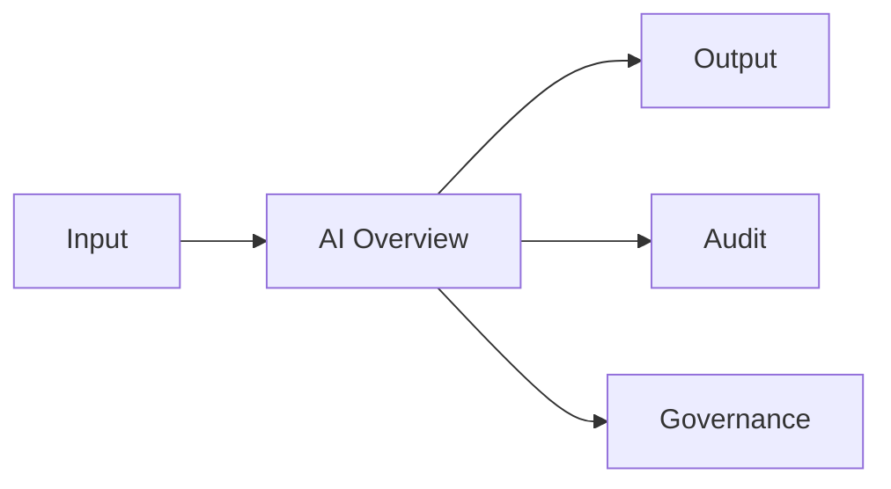

# AI Overview

> *"Defines Clara AI as a platform capability, not a standalone feature."*

---

# Purpose

Defines Clara AI as a platform capability, not a standalone feature.

This chapter explains the blueprint-level role of **AI Overview** inside Clara's AI Platform.

---

# Overview

The **AI Overview** is part of Clara's governed AI architecture.

It should work together with the AI Gateway, Model Gateway, Prompt Engine, Context Engine, Memory Engine, Knowledge Engine, AI Skills, AI Agents, Tool Calling, AI Workflow, Governance, and Evaluation.

This chapter does not define low-level implementation details. It defines the platform responsibility and boundary.

---

# Responsibilities

The **AI Overview** is responsible for:

- Supporting secure AI execution.
- Preserving Organization and Workspace boundaries.
- Integrating with the rest of the AI Platform.
- Supporting observability and auditability.
- Enabling reusable AI capabilities across Clara domains.
- Avoiding provider-specific lock-in unless explicitly documented.

---

# Relationship Map

---

# Platform Role

The **AI Overview** should be treated as a platform capability.

It should not be implemented separately inside every business domain.

Business domains should consume the AI Platform through stable contracts instead of duplicating AI logic locally.

---

# Security Considerations

The **AI Overview** must enforce:

- Authentication.
- Authorization.
- Tenant and Workspace isolation.
- Sensitive data protection.
- Audit logging.
- Prompt and output safety where relevant.
- Human review for sensitive or destructive actions.

AI must never receive unrestricted access to Clara data.

---

# AI Governance Considerations

The **AI Overview** should support governance through:

- Traceable execution.
- Versioned configuration where relevant.
- Observable inputs and outputs.
- Policy-based access.
- Evaluation feedback.
- Human oversight where required.

---

# Failure Scenarios

Possible failure scenarios include:

- Missing or invalid context.
- Unauthorized data access attempt.
- Model provider unavailable.
- Tool execution failure.
- Low-confidence output.
- Unsafe output.
- Governance policy violation.

The system should fail safely and preserve auditability.

---

# Key Takeaways

- Defines Clara AI as a platform capability, not a standalone feature.
- It is part of Clara's shared AI Platform.
- It should be secure, observable, and governed.
- It should not bypass Organization, Workspace, Role, or Permission boundaries.

---

# Related Documents

- ../../standards/AI-DOCUMENTATION-STANDARD.md
- ../../templates/ai-template.md
- ../../glossary/Agent.md
- ../../glossary/Model.md
- ../../glossary/Context.md
- ../../glossary/Knowledge.md
- ../../glossary/Memory.md

---

# Navigation

**Previous:** ./README.md

**Next:** ./43-AI-Gateway.md
