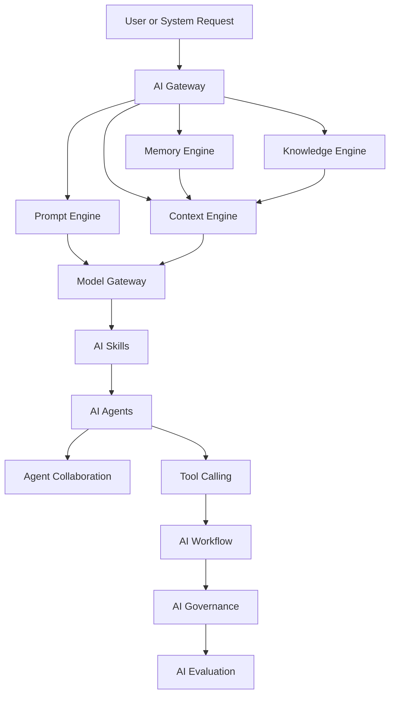

# PART-04 — AI Platform

> *"AI in Clara is a governed platform capability, not an isolated chatbot feature."*

---

# Purpose

Part IV defines the AI Platform layer of Clara.

The AI Platform provides the reusable foundation for AI Gateway, Model Gateway, Prompt Engine, Context Engine, Memory Engine, Knowledge Engine, AI Skills, AI Agents, Agent Collaboration, Tool Calling, AI Workflow, Governance, and Evaluation.

This Part explains how Clara uses AI safely, securely, observably, and consistently across business domains.

---

# Goals

- Define AI as a first-class platform layer.
- Separate AI capabilities from business domain logic.
- Establish a governed architecture for AI requests, prompts, context, memory, knowledge, models, tools, agents, and workflows.
- Preserve human oversight and authorization boundaries.
- Provide a foundation for Book V — AI Bible.

---

# Scope

## In Scope

- AI Gateway.
- Model Gateway.
- Prompt Engine.
- Context Engine.
- Memory Engine.
- Knowledge Engine.
- AI Skills.
- AI Agents.
- Agent Collaboration.
- Tool Calling.
- AI Workflow.
- AI Governance.
- AI Evaluation.

## Out of Scope

- Provider-specific implementation.
- Final prompt text.
- Final model selection.
- Final vector database design.
- Low-level agent runtime code.
- Production deployment details.

---

# Chapter Map

| Chapter | Title | Purpose |
|---|---|---|
| 42 | AI Overview | Defines the role of AI inside Clara |
| 43 | AI Gateway | Defines the unified entry point for AI requests |
| 44 | Model Gateway | Defines model provider abstraction |
| 45 | Prompt Engine | Defines prompt assembly and versioning |
| 46 | Context Engine | Defines authorized context construction |
| 47 | Memory Engine | Defines memory storage and retrieval |
| 48 | Knowledge Engine | Defines organizational knowledge retrieval |
| 49 | AI Skills | Defines reusable AI capabilities |
| 50 | AI Agents | Defines agent responsibilities and boundaries |
| 51 | Agent Collaboration | Defines multi-agent coordination |
| 52 | Tool Calling | Defines secure tool execution |
| 53 | AI Workflow | Defines AI participation in workflows |
| 54 | AI Governance | Defines AI policies, audit, and human oversight |
| 55 | AI Evaluation | Defines measurement and quality control |

---

# AI Platform Map

---

# Key Principles

- AI must respect Organization and Workspace boundaries.
- AI must not bypass authorization.
- AI output must be observable, reviewable, and auditable.
- Human authority remains final for sensitive actions.
- Model providers should be abstracted behind the Model Gateway.
- AI capabilities should be reusable through Skills, Agents, and Workflows.

---

# Related Documents

- ../../BOOK-01-The-Foundation/09-AI-Philosophy.md
- ../../standards/AI-DOCUMENTATION-STANDARD.md
- ../../templates/ai-template.md
- ../../glossary/Agent.md
- ../../glossary/Model.md
- ../../glossary/Context.md
- ../../glossary/Knowledge.md
- ../../glossary/Memory.md

---

# Navigation

**Previous:** ../PART-03-Business-Domains/41-Custom-Objects.md

**Next:** 42-AI-Overview.md
