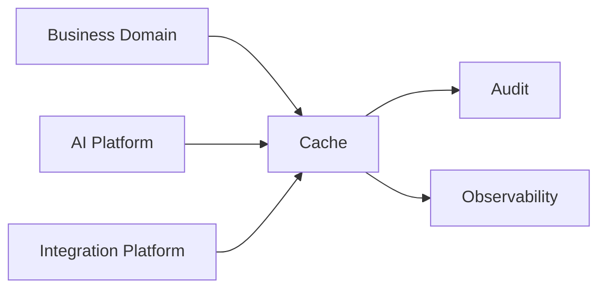

# Cache

> *"Defines temporary data acceleration, rate optimization, session support, and expensive computation reuse."*

---

# Purpose

Defines temporary data acceleration, rate optimization, session support, and expensive computation reuse.

This chapter explains the blueprint-level role of **Cache** as a shared Platform Service in Athena.

---

# Overview

The **Cache** service provides a reusable capability that should be consumed by business domains, AI components, integration capabilities, workflows, and operational tools through stable contracts.

It should not be reimplemented independently inside every domain.

---

# Responsibilities

The **Cache** service is responsible for:

- Providing a shared platform capability.
- Exposing clear and stable interfaces.
- Supporting Organization and Workspace boundaries.
- Integrating with Audit where important actions occur.
- Supporting observability through logs, metrics, and traces.
- Providing safe failure behavior.
- Supporting future extensibility.

---

# Platform Role

The **Cache** service should act as a platform primitive.

Business domains should depend on it through approved interfaces rather than building local, inconsistent versions of the same capability.

---

# Reference Flow

---

# Consumers

Potential consumers include:

- CRM.
- Customer Support.
- Workflow.
- Automation.
- AI Agents.
- Integrations.
- Admin Console.
- Reporting.
- Operations.

---

# Security Considerations

The **Cache** service must enforce:

- Authentication.
- Authorization.
- Organization isolation.
- Workspace isolation.
- Least privilege.
- Input validation.
- Output safety.
- Audit logging where relevant.
- Secure handling of sensitive data.

Service consumers must not bypass platform-level controls.

---

# Observability

The **Cache** service should expose:

- Structured logs.
- Metrics.
- Traces.
- Health checks.
- Failure counts.
- Latency measurements.
- Audit events where applicable.

---

# Failure Scenarios

Possible failure scenarios include:

- Dependency unavailable.
- Invalid input.
- Authorization failure.
- Timeout.
- Retry exhaustion.
- Rate limit exceeded.
- Partial processing failure.

Failures should be safe, visible, and recoverable where possible.

---

# Future Evolution

The **Cache** service may evolve with:

- Additional provider support.
- Better observability.
- More granular permissions.
- Stronger governance controls.
- Improved developer experience.
- Deeper integration with AI and Workflow.

---

# Key Takeaways

- Defines temporary data acceleration, rate optimization, session support, and expensive computation reuse.
- It is a shared Platform Service.
- Domains should consume it through stable contracts.
- Security, observability, and governance must be built in.

---

# Related Documents

- ../../templates/service-template.md
- ../../glossary/Service.md
- ../../glossary/Workflow.md
- ../../glossary/Event.md
- ../../standards/SECURITY-DOCS-STANDARD.md

---

# Navigation

**Previous:** ./65-Storage.md

**Next:** ./67-Reporting.md
