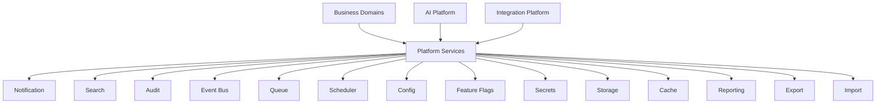

# PART-05 — Platform Services

> *"Platform services are shared capabilities that prevent every domain from rebuilding the same foundation."*

---

# Purpose

Part V defines Athena's shared Platform Services.

Platform Services provide reusable capabilities used across business domains, AI capabilities, integrations, workflows, and operational systems.

These services reduce duplication, improve consistency, and make Athena easier to secure, observe, scale, and maintain.

---

# Goals

- Define the reusable services that support Athena domains.
- Establish shared responsibility boundaries.
- Prevent duplicated local implementations.
- Create a blueprint for cross-domain platform capabilities.
- Support secure, observable, and scalable platform behavior.

---

# Scope

## In Scope

- Notification.
- Search.
- Audit.
- Event Bus.
- Queue.
- Scheduler.
- Configuration.
- Feature Flags.
- Secrets.
- Storage.
- Cache.
- Reporting.
- Export.
- Import.

## Out of Scope

- Final service implementation.
- Database schemas.
- Provider-specific infrastructure.
- Final API contracts.
- Deployment architecture.

---

# Chapter Map

| Chapter | Title | Purpose |
|---|---|---|
| 56 | Notification | Shared delivery of alerts, reminders, and messages |
| 57 | Search | Shared search across Athena data and knowledge |
| 58 | Audit | Shared audit trail for critical actions |
| 59 | Event Bus | Shared event backbone |
| 60 | Queue | Shared asynchronous job processing |
| 61 | Scheduler | Shared time-based execution |
| 62 | Config | Shared configuration management |
| 63 | Feature Flags | Controlled rollout and experimentation |
| 64 | Secrets | Secure secret management |
| 65 | Storage | File and object storage |
| 66 | Cache | Temporary acceleration and reuse |
| 67 | Reporting | Reports, dashboards, and summaries |
| 68 | Export | Controlled outbound data movement |
| 69 | Import | Controlled inbound data movement |

---

# Platform Services Map

---

# Key Principles

- Shared capabilities should be implemented once and reused everywhere.
- Platform Services must enforce security and auditability.
- Services should expose clear contracts.
- Business domains should not bypass shared platform services.
- AI and integrations must use Platform Services through governed interfaces.

---

# Related Documents

- ../PART-03-Business-Domains/README.md
- ../PART-04-AI-Platform/README.md
- ../../templates/service-template.md
- ../../glossary/Service.md
- ../../glossary/Event.md
- ../../standards/SECURITY-DOCS-STANDARD.md

---

# Navigation

**Previous:** ../PART-04-AI-Platform/55-AI-Evaluation.md

**Next:** 56-Notification.md
