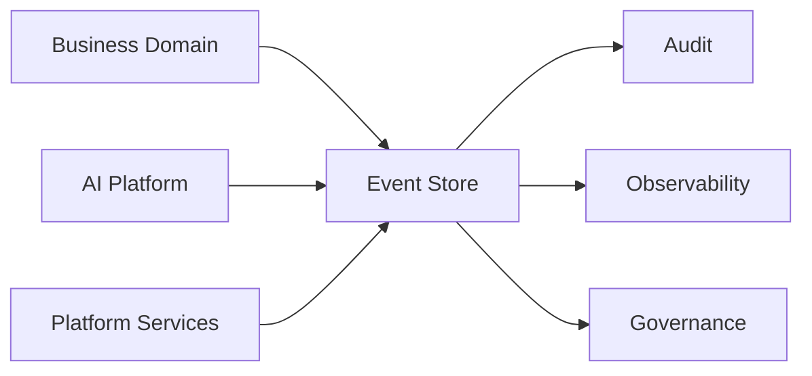

# Event Store

> *"Defines the platform role of storing important business events for replay, analytics, audit, and integration."*

---

# Purpose

Defines the platform role of storing important business events for replay, analytics, audit, and integration.

This chapter defines the blueprint-level responsibility of **Event Store** inside Clara's Data Platform.

---

# Overview

The **Event Store** capability is part of Clara's shared Data Platform.

It supports business domains, AI capabilities, platform services, integrations, analytics, and operations by ensuring data is stored, accessed, transformed, protected, and recovered consistently.

This document defines the platform role and boundaries, not the final low-level implementation.

---

# Responsibilities

The **Event Store** capability is responsible for:

- Supporting reliable data operations.
- Preserving Organization and Workspace boundaries.
- Supporting data ownership and source-of-truth rules.
- Integrating with Audit where important actions occur.
- Supporting security, privacy, and governance.
- Supporting observability and operational health.
- Providing a foundation for future implementation documents.

---

# Data Platform Role

The **Event Store** capability should be treated as a shared platform capability.

Business domains should not create inconsistent data patterns when the Data Platform already provides an approved approach.

---

# Reference Flow

---

# Design Considerations

The **Event Store** design should consider:

- Data classification.
- Ownership.
- Access patterns.
- Retention.
- Backup.
- Recovery.
- Searchability.
- AI retrieval needs.
- Scalability.
- Cost.
- Operational complexity.

---

# Security Considerations

The **Event Store** capability must enforce:

- Authentication.
- Authorization.
- Organization isolation.
- Workspace isolation.
- Least privilege.
- Encryption where appropriate.
- Sensitive data protection.
- Audit logging.
- Secure operational access.

Data access must never rely only on client-side filtering.

---

# Privacy Considerations

The **Event Store** capability may handle personal, customer, organizational, or sensitive operational data.

Privacy requirements should consider:

- Data minimization.
- Retention.
- Deletion.
- Export controls.
- Access review.
- AI retrieval boundaries.

---

# Observability

The **Event Store** capability should expose:

- Logs.
- Metrics.
- Traces.
- Health checks.
- Latency.
- Error rates.
- Capacity indicators.
- Data processing status.

---

# Failure Scenarios

Possible failure scenarios include:

- Data unavailable.
- Partial write failure.
- Stale derived data.
- Unauthorized access attempt.
- Corrupted index.
- Failed pipeline.
- Backup failure.
- Recovery delay.

Failures should be visible, recoverable, and auditable.

---

# Future Evolution

The **Event Store** capability may evolve with:

- Stronger governance.
- Improved automation.
- Better observability.
- More granular access controls.
- AI-assisted data quality checks.
- More advanced scaling strategies.
- Provider-specific implementation details in later architecture documents.

---

# Key Takeaways

- Defines the platform role of storing important business events for replay, analytics, audit, and integration.
- It is part of Clara's shared Data Platform.
- It must preserve ownership, security, privacy, and recoverability.
- It supports business domains, platform services, AI, analytics, and operations.

---

# Related Documents

- ../../templates/database-spec-template.md
- ../../standards/SECURITY-DOCS-STANDARD.md
- ../../glossary/Event.md
- ../../glossary/Knowledge.md
- ../../glossary/Context.md
- ../../glossary/Memory.md

---

# Navigation

**Previous:** ./72-Data-Lifecycle.md

**Next:** ./74-Knowledge-Store.md
