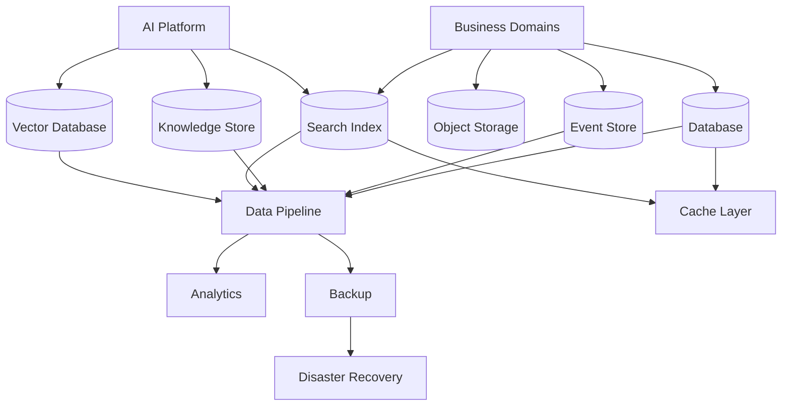

# PART-06 — Data Platform

> *"Data becomes valuable when it is owned, protected, connected, and useful."*

---

# Purpose

Part VI defines Clara's Data Platform.

The Data Platform provides the foundation for databases, ownership, lifecycle, event storage, knowledge storage, search, vector retrieval, object storage, caching, pipelines, backup, and disaster recovery.

This Part ensures Clara data can remain trustworthy, secure, searchable, recoverable, and useful for humans, systems, analytics, and AI.

---

# Goals

- Define Clara's high-level data architecture.
- Establish clear ownership and source-of-truth rules.
- Support operational, analytical, search, AI, and archival data needs.
- Protect data through lifecycle, backup, and recovery policies.
- Prevent duplicated authority across domains and services.
- Support AI through knowledge, search, vector retrieval, and pipelines.

---

# Scope

## In Scope

- Database strategy.
- Data ownership.
- Data lifecycle.
- Event store.
- Knowledge store.
- Search index.
- Vector database.
- Object storage.
- Cache layer.
- Data pipeline.
- Backup.
- Disaster recovery.

## Out of Scope

- Final database engine selection.
- Final schema design.
- Cloud-provider-specific storage details.
- Low-level ETL implementation.
- Production infrastructure topology.

---

# Chapter Map

| Chapter | Title | Purpose |
|---|---|---|
| 70 | Database Strategy | Defines Clara's database strategy |
| 71 | Data Ownership | Defines ownership and source of truth |
| 72 | Data Lifecycle | Defines creation, retention, deletion, and recovery |
| 73 | Event Store | Defines event persistence and replay |
| 74 | Knowledge Store | Defines trusted knowledge storage |
| 75 | Search Index | Defines searchable data indexing |
| 76 | Vector Database | Defines embedding and semantic retrieval storage |
| 77 | Object Storage | Defines file and artifact storage |
| 78 | Cache Layer | Defines temporary acceleration and reuse |
| 79 | Data Pipeline | Defines data movement and transformation |
| 80 | Backup | Defines backup protection |
| 81 | Disaster Recovery | Defines recovery and business continuity |

---

# Data Platform Map

---

# Key Principles

- Every important entity should have a clear owner.
- Every source of truth should be explicit.
- Derived data must not become an accidental authority.
- Data used by AI must respect authorization and privacy boundaries.
- Backup and recovery are part of data architecture, not operational afterthoughts.
- Data lifecycle must be documented before production usage.

---

# Related Documents

- ../PART-03-Business-Domains/README.md
- ../PART-04-AI-Platform/README.md
- ../PART-05-Platform-Services/README.md
- ../../templates/database-spec-template.md
- ../../glossary/Knowledge.md
- ../../glossary/Event.md

---

# Navigation

**Previous:** ../PART-05-Platform-Services/69-Import.md

**Next:** 70-Database-Strategy.md
