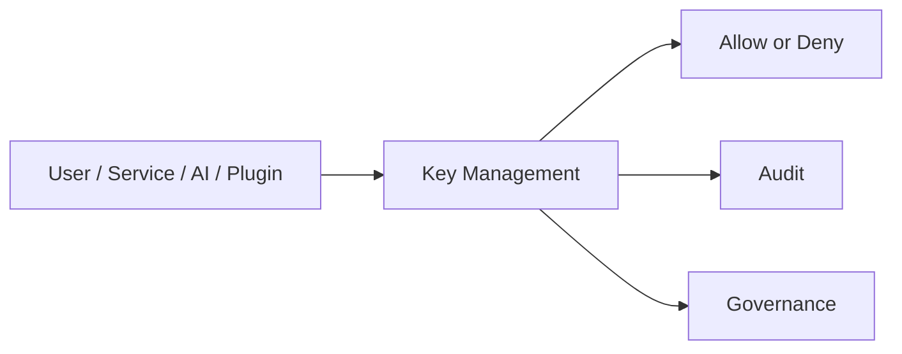

# Key Management

> *"Defines how cryptographic keys are created, stored, rotated, accessed, and retired."*

---

# Purpose

Defines how cryptographic keys are created, stored, rotated, accessed, and retired.

This chapter defines the blueprint-level responsibility of **Key Management** inside Athena's Security Platform.

---

# Overview

The **Key Management** capability is part of Athena's shared Security Platform.

It protects Athena across Organizations, Workspaces, business domains, platform services, AI capabilities, integrations, plugins, and infrastructure.

This document defines the security role and boundary at blueprint level. Implementation details should be defined later in security architecture, runbooks, and technical specifications.

---

# Responsibilities

The **Key Management** capability is responsible for:

- Protecting Athena resources.
- Supporting secure access patterns.
- Preserving Organization and Workspace boundaries.
- Reducing security risk.
- Supporting auditability.
- Supporting governance.
- Enabling consistent security behavior across domains and services.
- Providing security requirements for future implementation.

---

# Security Platform Role

The **Key Management** capability should be treated as a shared security foundation.

Business domains, AI components, integrations, plugins, and platform services should not implement inconsistent or local-only security controls when a shared Security Platform capability exists.

---

# Reference Flow

---

# Design Considerations

The **Key Management** design should consider:

- Organization boundaries.
- Workspace boundaries.
- Identity.
- Authorization.
- Least privilege.
- Sensitive data.
- AI access.
- Plugin access.
- Integration access.
- Audit requirements.
- Failure behavior.

---

# AI Security Considerations

AI capabilities must follow the same security requirements as other platform capabilities.

The **Key Management** capability should ensure AI does not:

- Access unauthorized context.
- Retrieve restricted knowledge.
- Use tools without permission.
- Expose sensitive data.
- Execute sensitive actions without human review where required.
- Bypass audit logging.

---

# Plugin and Integration Considerations

Plugins and integrations must be treated as untrusted until authenticated, authorized, scoped, validated, and audited.

The **Key Management** capability should help enforce:

- Explicit permission scopes.
- Secret isolation.
- Rate limiting where appropriate.
- Webhook validation where relevant.
- Secure external communication.
- Revocation and rotation where applicable.

---

# Observability

The **Key Management** capability should expose:

- Security events.
- Authorization failures.
- Configuration changes.
- Policy violations.
- Suspicious activity.
- Administrative actions.
- Audit records.
- Alertable metrics.

---

# Failure Scenarios

Possible failure scenarios include:

- Unauthorized access attempt.
- Misconfigured permissions.
- Secret exposure.
- Key rotation failure.
- Audit logging failure.
- Policy conflict.
- External integration compromise.
- AI prompt injection attempt.
- Privilege escalation attempt.

Security-sensitive failures should fail closed where appropriate.

---

# Future Evolution

The **Key Management** capability may evolve with:

- Stronger policy engine support.
- Better automation.
- More granular access control.
- Advanced threat detection.
- Improved compliance reporting.
- AI-assisted security review.
- Automated risk scoring.
- Stronger integration with audit and observability.

---

# Key Takeaways

- Defines how cryptographic keys are created, stored, rotated, accessed, and retired.
- It is part of Athena's shared Security Platform.
- It must protect Organization, Workspace, data, AI, services, plugins, and integrations.
- It should be observable, auditable, and governed.

---

# Related Documents

- ../../standards/SECURITY-DOCS-STANDARD.md
- ../../templates/security-template.md
- ../../glossary/User.md
- ../../glossary/Role.md
- ../../glossary/Permission.md
- ../PART-02-Organization-Layer/README.md
- ../PART-04-AI-Platform/README.md

---

# Navigation

**Previous:** ./85-Encryption.md

**Next:** ./87-Secrets.md
