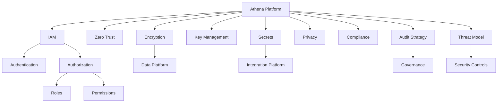

# PART-07 — Security Platform

> *"Security is not a feature in Athena. Security is a platform foundation."*

---

# Purpose

Part VII defines Athena's Security Platform.

The Security Platform provides the shared foundation for identity, access management, zero trust, encryption, key management, secrets, privacy, compliance, audit strategy, and threat modeling.

Security must protect every layer of Athena:

- Organization.
- Workspace.
- Users.
- Roles.
- Permissions.
- Business domains.
- AI platform.
- Platform services.
- Data platform.
- Integration platform.
- Infrastructure.
- Plugins.

---

# Goals

- Establish security as a shared platform capability.
- Define Athena's high-level security model.
- Protect Organization and Workspace boundaries.
- Support secure identity and access management.
- Ensure sensitive data is encrypted and governed.
- Provide auditability for important actions.
- Support privacy, compliance, and threat modeling.
- Ensure AI, plugins, integrations, and services do not bypass security controls.

---

# Scope

## In Scope

- Security overview.
- IAM.
- Zero Trust.
- Encryption.
- Key management.
- Secrets management.
- Privacy.
- Compliance.
- Audit strategy.
- Threat model.

## Out of Scope

- Final implementation details.
- Vendor-specific security services.
- Final compliance certification requirements.
- Infrastructure-specific hardening steps.
- Full penetration testing methodology.

Those topics belong in later security architecture, runbooks, and implementation documents.

---

# Chapter Map

| Chapter | Title | Purpose |
|---|---|---|
| 82 | Security Overview | Defines Athena's security platform foundation |
| 83 | IAM | Defines identity and access management |
| 84 | Zero Trust | Defines no-trust-by-default posture |
| 85 | Encryption | Defines data protection through encryption |
| 86 | Key Management | Defines cryptographic key lifecycle |
| 87 | Secrets | Defines secret handling and protection |
| 88 | Privacy | Defines personal and sensitive data protection |
| 89 | Compliance | Defines policy, legal, and audit support |
| 90 | Audit Strategy | Defines traceability and accountability |
| 91 | Threat Model | Defines threat identification and mitigation |

---

# Security Platform Map

---

# Core Security Principles

- Deny by default.
- Least privilege.
- Strong identity.
- Explicit authorization.
- Defense in depth.
- Secure defaults.
- Auditability.
- Data minimization.
- Zero trust.
- Human oversight for sensitive AI actions.
- No unrestricted plugin or AI access.

---

# Related Documents

- ../PART-02-Organization-Layer/README.md
- ../PART-04-AI-Platform/README.md
- ../PART-06-Data-Platform/README.md
- ../../standards/SECURITY-DOCS-STANDARD.md
- ../../templates/security-template.md
- ../../glossary/User.md
- ../../glossary/Role.md
- ../../glossary/Permission.md

---

# Navigation

**Previous:** ../PART-06-Data-Platform/81-Disaster-Recovery.md

**Next:** 82-Security-Overview.md
