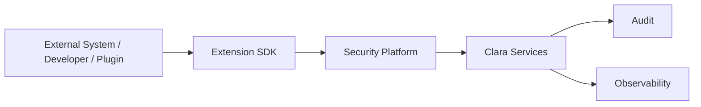

# Extension SDK

> *"Defines extension points for UI, workflow, AI, integrations, and domain-specific customization."*

---

# Purpose

Defines extension points for UI, workflow, AI, integrations, and domain-specific customization.

This chapter defines the blueprint-level role of **Extension SDK** inside Clara's Integration Platform.

---

# Overview

The **Extension SDK** capability allows Clara to connect with external systems, internal services, client applications, plugins, extensions, and developer tools through governed integration contracts.

It should preserve security, observability, auditability, and compatibility across Organization and Workspace boundaries.

---

# Responsibilities

The **Extension SDK** capability is responsible for:

- Providing a governed integration pattern.
- Supporting stable contracts for consumers.
- Enforcing authentication and authorization.
- Preserving Organization and Workspace isolation.
- Supporting auditability for sensitive operations.
- Supporting rate limiting and abuse protection where relevant.
- Supporting versioning and backward compatibility.
- Supporting observability through logs, metrics, and traces.

---

# Integration Role

The **Extension SDK** capability should be treated as part of Clara's shared Integration Platform.

Business domains should not expose inconsistent or ungoverned integration surfaces when a shared platform pattern exists.

---

# Reference Flow

---

# Common Consumers

Potential consumers include:

- External applications.
- Partner systems.
- Internal services.
- Browser extensions.
- Mobile applications.
- Plugins.
- AI tools.
- Workflow automations.
- Third-party SaaS platforms.

---

# Security Considerations

The **Extension SDK** capability must enforce:

- Authentication.
- Authorization.
- Least privilege.
- Tenant and Workspace isolation.
- Input validation.
- Output safety.
- Rate limiting where relevant.
- Abuse detection where relevant.
- Audit logging for sensitive actions.
- Secret protection where relevant.

External systems must never receive unrestricted access by default.

---

# Privacy Considerations

Integrations may exchange personal, customer, operational, or sensitive business data.

Clara must ensure:

- Data minimization.
- Consent where required.
- Controlled exports.
- Retention awareness.
- Deletion behavior.
- Provider trust evaluation.
- Auditability.

---

# Observability

The **Extension SDK** capability should expose:

- Request logs.
- Error rates.
- Latency.
- Rate-limit events.
- Authentication failures.
- Authorization failures.
- Provider errors.
- Retry counts.
- Audit events.

---

# Failure Scenarios

Possible failure scenarios include:

- Invalid credentials.
- Expired token.
- Provider outage.
- Webhook replay.
- Rate limit exceeded.
- Network timeout.
- Invalid payload.
- Permission mismatch.
- Version incompatibility.

Failures should be visible, recoverable, and safe.

---

# Future Evolution

The **Extension SDK** capability may evolve with:

- Improved developer experience.
- Stronger versioning.
- Better sandbox support.
- More granular permission scopes.
- Advanced marketplace governance.
- AI-assisted integration diagnostics.
- Connector certification.
- Automated compatibility testing.

---

# Key Takeaways

- Defines extension points for UI, workflow, AI, integrations, and domain-specific customization.
- It is part of Clara's shared Integration Platform.
- It must preserve security, privacy, observability, and governance.
- It should expose stable contracts instead of internal implementation details.

---

# Related Documents

- ../../templates/integration-spec-template.md
- ../../templates/api-template.md
- ../../glossary/Plugin.md
- ../../glossary/Service.md
- ../../standards/SECURITY-DOCS-STANDARD.md
- ../PART-07-Security-Platform/README.md

---

# Navigation

**Previous:** ./97-Plugin-SDK.md

**Next:** ./99-Marketplace.md
