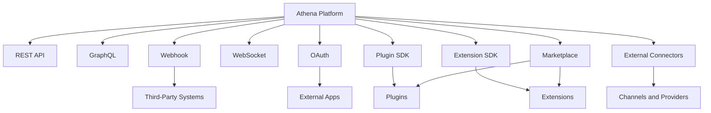

# PART-08 — Integration Platform

> *"Athena becomes more valuable when it can connect safely with the systems organizations already use."*

---

# Purpose

Part VIII defines Athena's Integration Platform.

The Integration Platform provides the shared foundation for REST APIs, GraphQL, Webhooks, WebSocket, OAuth, Plugin SDK, Extension SDK, Marketplace, and External Connectors.

It allows Athena to integrate with third-party systems, communication channels, AI providers, business tools, developer tools, and custom organizational systems while preserving security, governance, auditability, and maintainability.

---

# Goals

- Define Athena's integration surface.
- Establish safe external access patterns.
- Support APIs, webhooks, real-time communication, OAuth, plugins, extensions, marketplace, and connectors.
- Protect Organization and Workspace boundaries.
- Ensure integrations are observable, auditable, and governed.
- Prevent external systems from bypassing core Athena security controls.

---

# Scope

## In Scope

- REST API.
- GraphQL.
- Webhook.
- WebSocket.
- OAuth.
- Plugin SDK.
- Extension SDK.
- Marketplace.
- External Connectors.

## Out of Scope

- Final API schemas.
- Final SDK implementation.
- Final marketplace business model.
- Provider-specific connector details.
- Production deployment topology.

---

# Chapter Map

| Chapter | Title | Purpose |
|---|---|---|
| 92 | REST API | Stable API contract for systems |
| 93 | GraphQL | Flexible query interface |
| 94 | Webhook | Event delivery integration |
| 95 | WebSocket | Real-time communication |
| 96 | OAuth | Delegated authorization |
| 97 | Plugin SDK | Installable platform extensions |
| 98 | Extension SDK | Extension points and customization |
| 99 | Marketplace | Distribution and governance of extensions |
| 100 | External Connectors | Third-party system connectivity |

---

# Integration Platform Map

---

# Key Principles

- Integrations must be secure by default.
- External systems are untrusted until authenticated, authorized, validated, and audited.
- Integrations must respect Organization and Workspace boundaries.
- OAuth scopes and plugin permissions should follow least privilege.
- Webhooks must be verified before processing.
- SDKs should expose stable contracts, not internal implementation details.
- Marketplace distribution must preserve trust and governance.

---

# Related Documents

- ../PART-05-Platform-Services/README.md
- ../PART-07-Security-Platform/README.md
- ../../templates/integration-spec-template.md
- ../../glossary/Plugin.md
- ../../standards/SECURITY-DOCS-STANDARD.md

---

# Navigation

**Previous:** ../PART-07-Security-Platform/91-Threat-Model.md

**Next:** 92-REST-API.md
