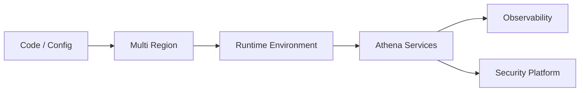

# Multi Region

> *"Defines infrastructure strategy for geographic resilience, latency reduction, and regional availability."*

---

# Purpose

Defines infrastructure strategy for geographic resilience, latency reduction, and regional availability.

This chapter defines the blueprint-level role of **Multi Region** inside Athena's Infrastructure layer.

---

# Overview

The **Multi Region** capability supports Athena's ability to run services reliably, securely, and consistently across environments.

It provides operational foundations for business domains, AI platform components, platform services, integration systems, and data services.

This chapter defines infrastructure direction, not final implementation details.

---

# Responsibilities

The **Multi Region** capability is responsible for:

- Supporting reliable platform operation.
- Enabling consistent runtime behavior.
- Supporting deployment and operational safety.
- Preserving Organization and Workspace boundaries where relevant.
- Supporting infrastructure observability.
- Supporting secure configuration.
- Supporting resilience and recovery.
- Providing a foundation for future runbooks and architecture documents.

---

# Infrastructure Role

The **Multi Region** capability should be treated as part of the shared infrastructure foundation.

Athena services should not depend on ad-hoc deployment or runtime patterns when a shared infrastructure model exists.

---

# Reference Flow

---

# Design Considerations

The **Multi Region** design should consider:

- Reliability.
- Scalability.
- Security.
- Maintainability.
- Cost.
- Automation.
- Observability.
- Disaster recovery.
- Multi-tenancy.
- Developer experience.

---

# Security Considerations

The **Multi Region** capability must support:

- Secure deployment.
- Least privilege.
- Secret isolation.
- Environment separation.
- Auditability.
- Secure network boundaries.
- Secure runtime configuration.
- Controlled administrative access.

Infrastructure must not expose sensitive services, secrets, logs, or data unintentionally.

---

# Observability

The **Multi Region** capability should support visibility into:

- Health.
- Latency.
- Errors.
- Resource usage.
- Deployment status.
- Runtime failures.
- Scaling events.
- Security-relevant events.

---

# Failure Scenarios

Possible failure scenarios include:

- Failed deployment.
- Misconfigured runtime.
- Container crash.
- Cluster capacity exhaustion.
- Network failure.
- Region failure.
- Monitoring outage.
- Logging pipeline failure.
- Tenant isolation failure.

Failures should be detectable, recoverable, and documented in runbooks.

---

# Future Evolution

The **Multi Region** capability may evolve with:

- More automation.
- Better developer tooling.
- Stronger security controls.
- Improved multi-region support.
- Better cost visibility.
- More advanced autoscaling.
- Infrastructure-as-code maturity.
- Platform engineering practices.

---

# Key Takeaways

- Defines infrastructure strategy for geographic resilience, latency reduction, and regional availability.
- It is part of Athena's shared Infrastructure layer.
- It should support secure, reliable, observable, and scalable operation.
- It should provide a foundation for production-grade Athena deployment.

---

# Related Documents

- ../../templates/runbook-template.md
- ../../templates/architecture-template.md
- ../../standards/SECURITY-DOCS-STANDARD.md
- ../PART-07-Security-Platform/README.md
- ../PART-06-Data-Platform/README.md

---

# Navigation

**Previous:** ./108-Tracing.md

**Next:** ./110-Multi-Tenant.md
